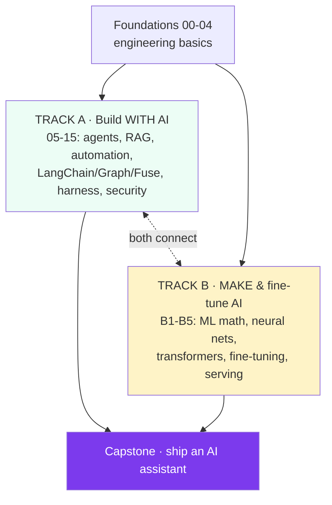
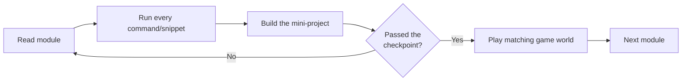
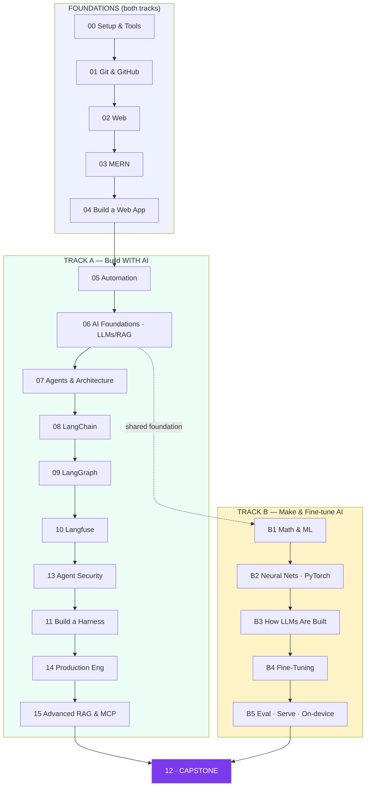
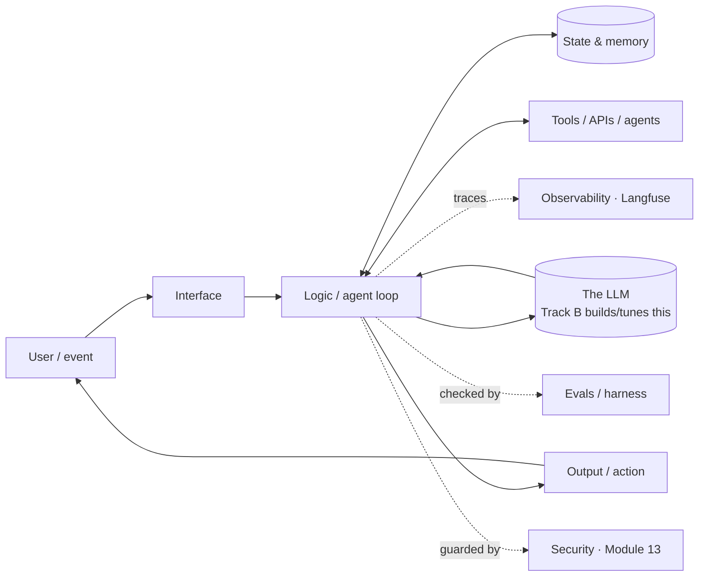

# Zero → AI Mastery

**A hands-on path from absolute basics to building, fine-tuning, and shipping AI.**

> **What you'll be able to do:** start by installing a code editor, and finish able to do two things most people can't — **build production AI products** (agents, RAG, multi-agent systems) *and* **build and fine-tune the models underneath them**. Every module follows the same shape: concepts → diagrams → commands and code you actually run → a mini-project.

---

## Two tracks

These are two distinct AI skill sets, and most courses teach only one. This curriculum covers both — and shows how they connect.



| | **Track A — Build WITH AI** | **Track B — Make & fine-tune AI** |
|---|------------------------------|-----------------------------------|
| You become | An **AI engineer** (application layer) | An **ML / AI engineer** (model layer) |
| You learn to | Use LLMs, build agents, RAG, automation, ship products | Train neural nets, understand transformers, fine-tune & serve models |
| Core tools | LangChain, LangGraph, Langfuse, MCP, Docker | PyTorch, Hugging Face, LoRA/QLoRA, vLLM |
| Math needed | Almost none | Light (vectors, gradients — taught in B1) |
| Typical use | Shipping AI products, automating workflows | Edge/on-device AI, custom or private models |

**Recommended order:** Foundations → **Track A** (ship something real first; it's more immediately useful) → **Track B** (go under the hood). They reinforce each other — but if model-building excites you more, you can jump to B1 right after Module 06.

---

## How to use this

1. **Go roughly in order.** Each module builds on the last. If you already know a topic, skim it and move on — don't grind through material you've already got.
2. **Type everything yourself.** Reading code ≠ knowing code.
3. **Do the mini-project at the end of each module before moving on.** That's the checkpoint.
4. **Play the game** (`game/index.html`) after every few modules — it runs real **JavaScript and Python** you write, and now covers both tracks.
5. **Keep a `learning-log.md`** in this folder. One paragraph per session: what clicked, what didn't.



---

## The full roadmap



---

## Module index

### Foundations (do first, skim what you know)
| # | Module | You'll be able to… | Mini-project |
|---|--------|--------------------|--------------|
| 00 | [Setup & Tools](modules/00-Setup-and-Tools.md) | Run code in VS Code; terminal; Node & Python | Run JS + Python |
| 01 | [Git & GitHub](modules/01-Git-and-GitHub.md) | Version, branch, merge, PR | Push a repo, merge a PR |
| 02 | [Web Foundations](modules/02-Web-Foundations.md) | HTTP, DOM, client/server; an interactive page | Interactive web page |
| 03 | [MERN Stack](modules/03-MERN-Stack.md) | API + DB + React | Notes API + React UI |
| 04 | [Build a Web App](modules/04-Build-a-Web-App.md) | Auth, structure, deploy | Deploy TaskVault |

### Track A — Build WITH AI
| # | Module | You'll be able to… | Mini-project |
|---|--------|--------------------|--------------|
| 05 | [Automation](modules/05-Automation.md) | APIs, webhooks, cron, workflows | Scheduled report bot |
| 06 | [AI Foundations](modules/06-AI-Foundations.md) | LLMs, prompting, embeddings, RAG | Chat-with-your-docs |
| 07 | [Agents & Architecture](modules/07-Agents-and-Architecture.md) | Agent loop, tools, memory, multi-agent | Research agent |
| 08 | [LangChain](modules/08-LangChain.md) | Chains, tools, retrievers | LangChain RAG agent |
| 09 | [LangGraph](modules/09-LangGraph.md) | Stateful, multi-agent graphs, HITL | Supervisor + workers |
| 10 | [Langfuse](modules/10-Langfuse-Observability.md) | Trace, score, evaluate | Instrument your agent |
| 13 | [AI Agent Security](modules/13-AI-Agent-Security.md) | Prompt injection defense, guardrails | Red-team your agent |
| 11 | [Build a Harness](modules/11-Building-a-Harness.md) | Eval + agent harness, CI for AI | Eval harness + gate |
| 14 | [Production Engineering](modules/14-Production-Engineering.md) | Docker, testing/CI, cost, OAuth, TypeScript | Containerize the stack |
| 15 | [Advanced RAG & MCP](modules/15-Advanced-RAG-and-MCP.md) | Re-ranking, hybrid search, build an MCP server | Better RAG + MCP server |

### Track B — Make & Fine-tune AI
| # | Module | You'll be able to… | Mini-project |
|---|--------|--------------------|--------------|
| B1 | [Math & ML Foundations](modules/B1-Math-and-ML-Foundations.md) | Loss, gradient descent, overfitting | Gradient descent from scratch |
| B2 | [Neural Networks & PyTorch](modules/B2-Neural-Networks-and-PyTorch.md) | Build & train a network; backprop | Train MNIST, cure overfitting |
| B3 | [How LLMs Are Built](modules/B3-How-LLMs-Are-Built.md) | Tokenization, attention, transformers, pretraining | Tokenizer + tiny GPT |
| B4 | [Fine-Tuning LLMs](modules/B4-Fine-Tuning-LLMs.md) | LoRA/QLoRA, datasets, fine-tune vs RAG | QLoRA fine-tune a model |
| B5 | [Eval, Serving & Deployment](modules/B5-Model-Eval-Serving-Deployment.md) | Benchmarks, quantization, serving, on-device | Quantize & serve a model |

### Capstone
| # | Module | Mini-project |
|---|--------|--------------|
| 12 | [Capstone — AI Assistant](modules/12-Capstone-AI-Assistant.md) | **Ship your own observable, evaluated AI assistant** |

**Total:** roughly 180–230 focused hours across both tracks. Track A alone (the faster route to a shipped product) is ~120–160h; Track B adds ~50–70h.

---

## The mental model that ties it together

Everything you build is the same shape: **input → logic → state → output**, wrapped in **tools** and watched by **observability**. Track A builds the *system*; Track B builds the *brain* the system calls.



---

## Glossary quick-reference

| Term | One-line meaning | Track/Module |
|------|------------------|--------------|
| API | Contract for programs to talk | A · 02/05 |
| LLM | Large Language Model | A · 06 |
| Token | Chunk of text the model reads/writes | A · 06, B · B3 |
| Embedding | Text → vector of numbers | A · 06, B · B1 |
| RAG | Retrieval-Augmented Generation | A · 06/15 |
| Agent | LLM in a loop with tools | A · 07 |
| Prompt injection | Attacker hijacks the model via text | A · 13 |
| Harness | Scaffolding that runs/tests an agent | A · 11 |
| Trace | Recorded story of one run | A · 10 |
| Container | App packaged with its environment | A · 14 |
| Gradient descent | How models learn (step downhill on loss) | B · B1 |
| Backprop | Computing gradients through a network | B · B2 |
| Transformer / attention | The architecture behind LLMs | B · B3 |
| Fine-tuning | Adapting a base model to your task | B · B4 |
| LoRA / QLoRA | Cheap, efficient fine-tuning | B · B4 |
| Quantization | Shrinking a model (fewer bits) | B · B5 |
| On-device / NPU | Running models on the edge | B · B5 |

---

## Conventions in every module

🎯 Goal · 🧠 Concept (with diagram) · ⌨️ Do this (commands/code) · ⚠️ Gotcha · 🛠️ Mini-project · ✅ You've mastered this when…

Now open [`modules/00-Setup-and-Tools.md`](modules/00-Setup-and-Tools.md) — or if you already know the basics, jump to [`05-Automation`](modules/05-Automation.md) (Track A) or [`B1`](modules/B1-Math-and-ML-Foundations.md) (Track B).

---

## Who this is for

Anyone going from near-zero to building and fine-tuning AI — career switchers, analysts, bootcamp grads, and self-taught developers. No prior AI experience is required; basic comfort using a computer is enough. Work through it at your own pace.

## How this repo is organized

```
Zero-to-AI-Mastery/
├── README.md          ← you are here
├── hub.html           ← open this to read everything in a clean web app
├── modules/           ← the curriculum (Markdown + Mermaid diagrams)
└── game/              ← the interactive coding game (real Python + JS)
    ├── index.html
    └── quest-data.js  ← keep beside index.html
```

Open `hub.html` in any modern browser to read the modules with diagrams rendered, or read the `modules/*.md` files directly on GitHub. Launch `game/index.html` to practice.

## License & contributing

Released under the MIT License — free to use, share, and adapt (see [`LICENSE`](LICENSE)). Issues and pull requests that improve clarity, fix errors, or add exercises are welcome.
