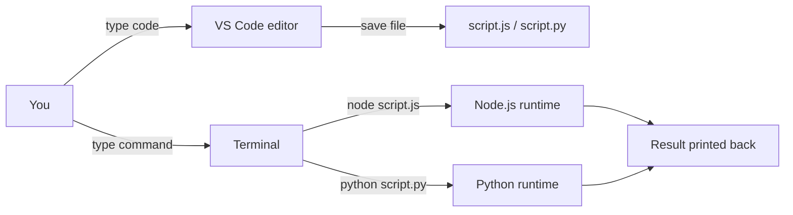
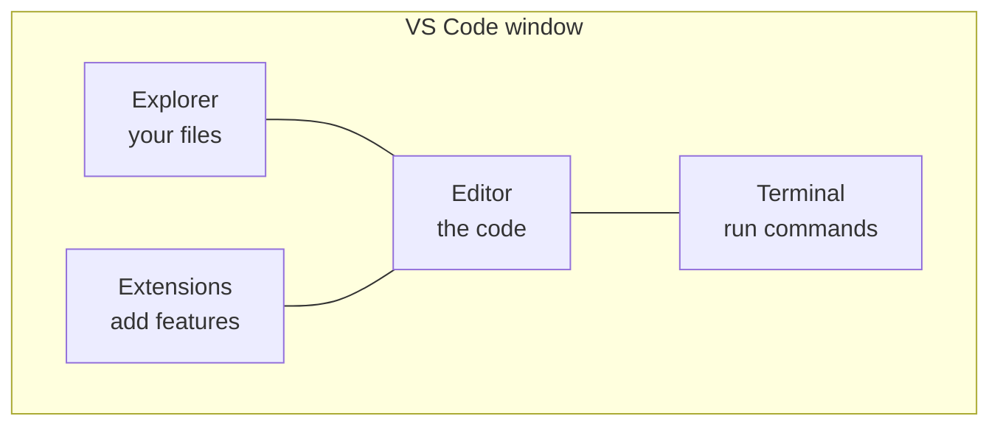
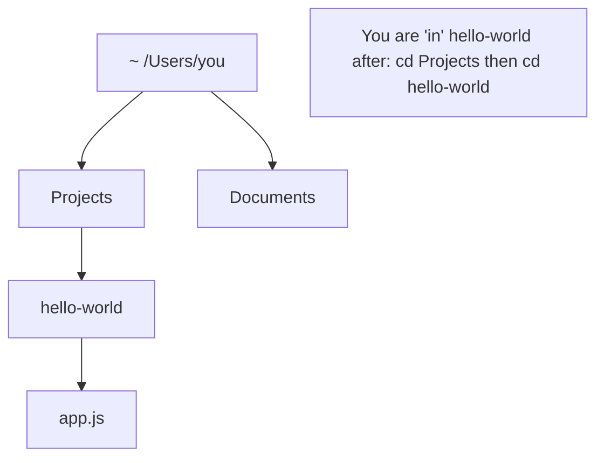
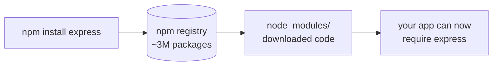

# Module 00 · Setup & Tools

🎯 **Goal:** Turn your computer into a place where you can write, run, and debug code. By the end you'll run JavaScript and Python from a terminal inside VS Code without blinking.

---

## 🧠 The three tools every developer lives in

| Tool | What it is | Analogy |
|------|------------|---------|
| **Editor / IDE** (VS Code) | Where you *write* code | Microsoft Word, but for code |
| **Terminal / shell** | Where you *run* commands | Texting orders to your computer |
| **Runtime** (Node.js, Python) | The engine that *executes* your code | The kitchen that cooks what you ordered |



---

## ⌨️ Step 1 — Install VS Code

VS Code is a free editor from Microsoft. It's the industry default and what you'll use for everything in this course.

1. Download from **[code.visualstudio.com](https://code.visualstudio.com)**, install, open it.
2. Learn these four panels — you'll use them constantly:



3. Open the integrated terminal: **`Ctrl + ` `** (backtick) on Windows/Linux, **`Cmd + ` `** on Mac. This terminal *is* your command line — no separate app needed.

**Install these 4 extensions** (click the square Extensions icon, search, Install):

| Extension | Why |
|-----------|-----|
| **Prettier** | Auto-formats your code on save — no more arguing about spaces |
| **ESLint** | Flags JS mistakes as you type |
| **Python** (Microsoft) | Runs/debugs Python, gives autocomplete |
| **GitLens** | Supercharges Git inside the editor (used in Module 01) |

⚠️ **Gotcha:** After installing Prettier, enable "Format On Save": open Settings (`Cmd/Ctrl + ,`), search `format on save`, tick the box. This single setting saves you hours.

---

## ⌨️ Step 2 — The terminal, demystified

The terminal feels intimidating because it's just a blinking cursor. It's not. It's a conversation: you type a command, hit Enter, it answers. Here are the only commands you need to start.

| Command | Does | Example |
|---------|------|---------|
| `pwd` | "Where am I?" (print working directory) | `pwd` |
| `ls` | List files here (`dir` on Windows cmd) | `ls` |
| `cd <folder>` | Move into a folder | `cd projects` |
| `cd ..` | Move up one folder | `cd ..` |
| `mkdir <name>` | Make a new folder | `mkdir hello-world` |
| `touch <file>` | Make an empty file (`ni` on Windows PowerShell) | `touch app.js` |
| `code .` | Open the current folder in VS Code | `code .` |
| `clear` | Clear the screen | `clear` |

**The mental model:** your files live in a tree of folders. The terminal always has a "current location." `cd` walks the tree; `ls` looks around; `pwd` tells you where you stand.



⚠️ **Gotcha — paths with spaces:** `cd My Folder` fails. Wrap it: `cd "My Folder"`. This bites everyone once.

---

## ⌨️ Step 3 — Install Node.js (the JavaScript runtime)

JavaScript was born in the browser. **Node.js** lets you run it *outside* the browser — on servers, scripts, tools. The entire MERN stack and most automation runs on Node.

1. Install **nvm** (Node Version Manager) — it lets you switch Node versions painlessly. On Mac/Linux:
   ```bash
   curl -o- https://raw.githubusercontent.com/nvm-sh/nvm/v0.40.1/install.sh | bash
   ```
   (Windows: install **nvm-windows** from its GitHub releases page instead.)
2. Restart the terminal, then install the latest long-term-support Node:
   ```bash
   nvm install --lts
   nvm use --lts
   ```
3. Verify:
   ```bash
   node --version   # e.g. v22.x.x
   npm --version    # npm ships with Node
   ```

**What's `npm`?** Node Package Manager — it downloads other people's code (libraries) into your project. You'll type `npm install <thing>` constantly.



---

## ⌨️ Step 4 — Install Python

Python is the language of AI/ML. You'll use it from Module 06 onward (LangChain, LangGraph, and Langfuse all have first-class Python).

1. Install **Python 3.12+** from **python.org** (Mac/Linux often have an old one preinstalled — install fresh). On Windows, **tick "Add Python to PATH"** during install.
2. Verify:
   ```bash
   python3 --version   # macOS/Linux
   python --version    # Windows
   pip3 --version      # pip = Python's package installer
   ```

**The one habit that saves you pain: virtual environments.** A "venv" is an isolated box of Python packages *per project*, so Project A's libraries never collide with Project B's.

```bash
# inside a project folder:
python3 -m venv .venv          # create the box
source .venv/bin/activate      # enter it (Mac/Linux)
.venv\Scripts\activate         # enter it (Windows)
pip install requests           # installs ONLY into this box
deactivate                     # leave the box
```

⚠️ **Gotcha:** If you `pip install` without activating a venv, packages go system-wide and eventually conflict. Always activate first. You'll know it's active when your terminal prompt shows `(.venv)`.

---

## 🛠️ Mini-project — "Hello, machine"

Prove the whole toolchain works end to end.

1. In the terminal:
   ```bash
   mkdir hello-machine && cd hello-machine && code .
   ```
2. In VS Code, create `hello.js`:
   ```javascript
   const name = "Ada";
   console.log(`Hello from Node, ${name}!`);
   console.log("2 + 2 =", 2 + 2);
   ```
   Run it: `node hello.js`
3. Create `hello.py`:
   ```python
   name = "Ada"
   print(f"Hello from Python, {name}!")
   print("2 + 2 =", 2 + 2)
   ```
   Run it: `python3 hello.py`
4. You should see both greetings print. **That's it — you can now run code in two languages.**

---

## ✅ You've mastered this when…

- [ ] You can open a folder in VS Code from the terminal with `code .`
- [ ] You can navigate folders with `cd`, `ls`, `pwd` without thinking
- [ ] `node --version` and `python3 --version` both return numbers
- [ ] You created and activated a Python venv
- [ ] Both `hello.js` and `hello.py` printed their greetings

**Next:** [01 · Git & GitHub](01-Git-and-GitHub.md) — never lose your work again, and start collaborating like a pro.
