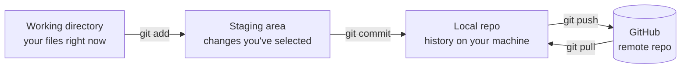
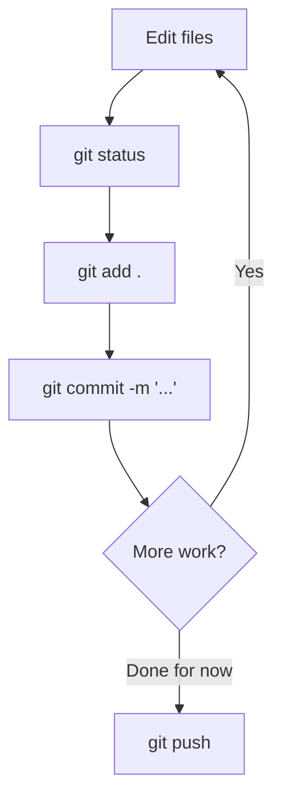
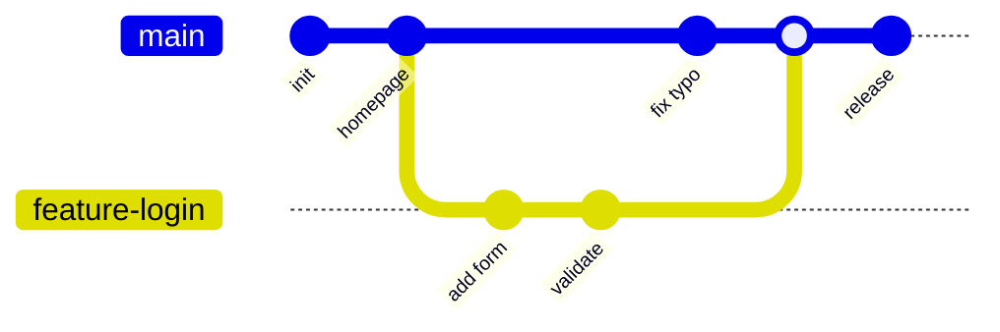
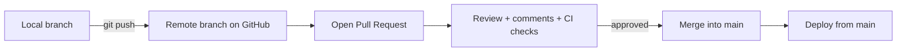

# Module 01 · Git & GitHub

🎯 **Goal:** Track every change to your code, work in parallel branches, undo mistakes, and collaborate through GitHub pull requests. This is the safety net under everything else you build.

---

## 🧠 Git vs GitHub — they're not the same thing

| | **Git** | **GitHub** |
|---|---------|------------|
| What | A program on *your* computer | A website that hosts Git repos |
| Job | Records snapshots of your code | Stores/shares them online, enables collaboration |
| Analogy | The "save + history" engine | Google Drive for code, with superpowers |
| Alternatives | (it's the standard) | GitLab, Bitbucket |

You can use Git with zero internet. GitHub is where it goes to be backed up and shared.



The **three areas** (working → staging → committed) confuse beginners. The point: you choose *exactly* which changes become a permanent snapshot. Staging is the "shopping cart"; commit is "checkout."

---

## ⌨️ One-time setup

```bash
git --version                              # confirm Git is installed
git config --global user.name  "Your Name"
git config --global user.email "you@example.com"
git config --global init.defaultBranch main
```

Make a free account at **github.com**. Then set up SSH or a Personal Access Token so you can push without typing your password every time (GitHub → Settings → Developer settings → Tokens, or follow GitHub's "Connect with SSH" guide).

---

## ⌨️ The core loop (90% of daily Git)

```bash
git init                  # turn a folder into a repo (once per project)
git status                # what's changed? (run this CONSTANTLY)
git add app.js            # stage one file
git add .                 # stage everything changed
git commit -m "Add login form"   # snapshot the staged changes
git log --oneline         # see history
```

**A good commit message** finishes the sentence *"If applied, this commit will…"* → "Add login form", "Fix off-by-one in pagination". Present tense, imperative, specific.



---

## 🧠 Branching — the killer feature

A **branch** is a parallel universe of your code. You build a feature on its own branch without touching the working `main` branch. When it's ready, you **merge** it back. This is how teams (and you) avoid breaking the live version.



```bash
git branch feature-login        # create a branch
git checkout feature-login      # switch to it
# (shortcut: git checkout -b feature-login does both)
# ...work, add, commit...
git checkout main               # go back to main
git merge feature-login         # bring the work in
git branch -d feature-login     # delete the finished branch
```

⚠️ **Gotcha — merge conflicts.** If `main` and your branch both edited the *same lines*, Git can't decide and marks a conflict:
```
<<<<<<< HEAD
const title = "TaskVault";
=======
const title = "Task Vault";
>>>>>>> feature-login
```
You manually edit to the version you want, delete the `<<<`, `===`, `>>>` markers, then `git add` and `git commit`. Conflicts feel scary once, then never again.

---

## 🧠 GitHub workflow — push, PR, merge

The professional loop. A **Pull Request (PR)** is a proposal: "here's my branch, please review and merge it." It's where code review, discussion, and CI checks happen.



```bash
# connect your local repo to GitHub (one time, get URL from the repo page):
git remote add origin git@github.com:yourname/taskvault.git
git push -u origin main          # first push of main
# later, for a feature:
git checkout -b feature-login
# ...commit work...
git push -u origin feature-login # push the branch
# then on github.com, click "Compare & pull request" → Create → Merge
```

---

## ⌨️ The "oh no" cheat sheet (undo anything)

| Situation | Command |
|-----------|---------|
| Discard unsaved changes to a file | `git checkout -- file.js` |
| Unstage a file (keep the edits) | `git restore --staged file.js` |
| Fix the last commit message | `git commit --amend -m "Better message"` |
| Undo last commit, keep changes | `git reset --soft HEAD~1` |
| See what changed | `git diff` |
| Throw away local changes, match GitHub | `git fetch && git reset --hard origin/main` ⚠️ destructive |
| "I'm lost, what's going on" | `git status` then `git log --oneline` |

⚠️ **`.gitignore` — never commit secrets or junk.** Create a `.gitignore` file listing things Git should ignore:
```
node_modules/
.venv/
.env
*.log
.DS_Store
```
Committing a `.env` with API keys to a public repo is the #1 beginner security disaster. The `.gitignore` prevents it.

---

## 🛠️ Mini-project — your first PR

1. Create a repo on GitHub called `taskvault-notes` (with a README).
2. Clone it: `git clone <url> && cd taskvault-notes`
3. Make a branch: `git checkout -b add-ideas`
4. Create `ideas.md`, write 3 product ideas, save.
5. `git add . && git commit -m "Add initial product ideas"`
6. `git push -u origin add-ideas`
7. On GitHub: open the PR, write a description, **merge it**, delete the branch.
8. Locally: `git checkout main && git pull` — watch your merged work arrive.

You just did the exact workflow used at every software company on earth.

---

## ✅ You've mastered this when…

- [ ] You can explain working dir → staging → commit → push in your own words
- [ ] You created a branch, committed on it, and merged it
- [ ] You deliberately caused a merge conflict and resolved it
- [ ] You opened and merged a Pull Request on GitHub
- [ ] You have a `.gitignore` that excludes `node_modules`, `.env`, `.venv`

**Next:** [02 · Web Foundations](02-Web-Foundations.md) — how the web actually works, and your first interactive page.
