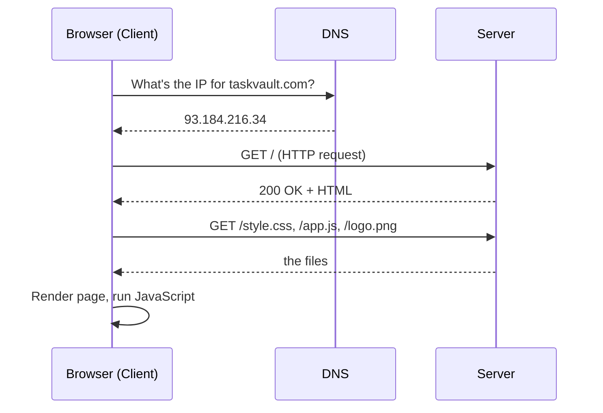
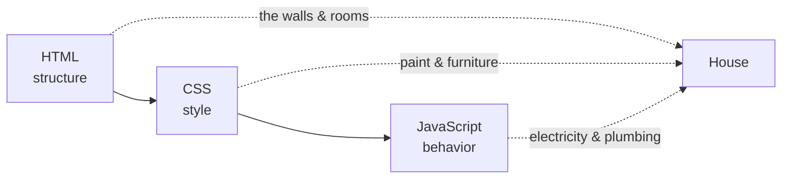
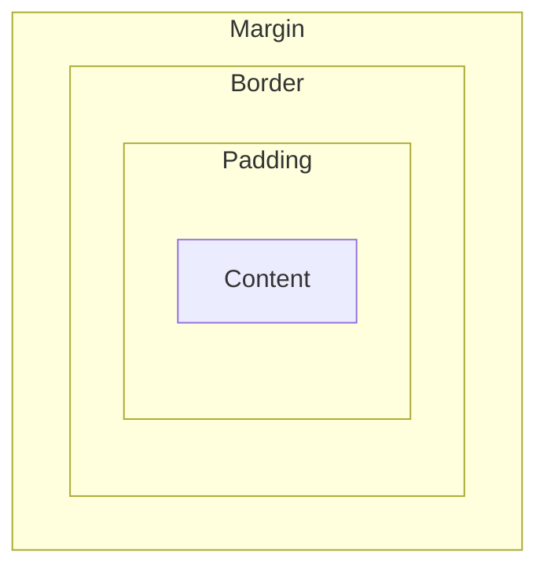
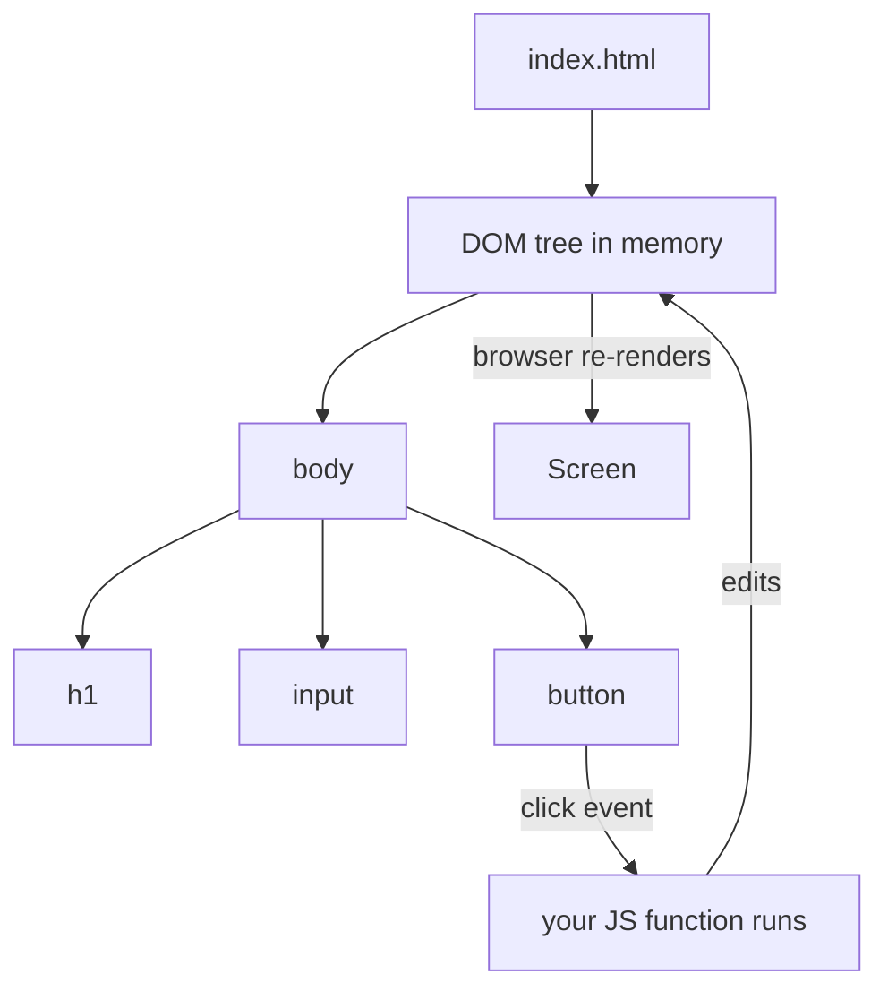
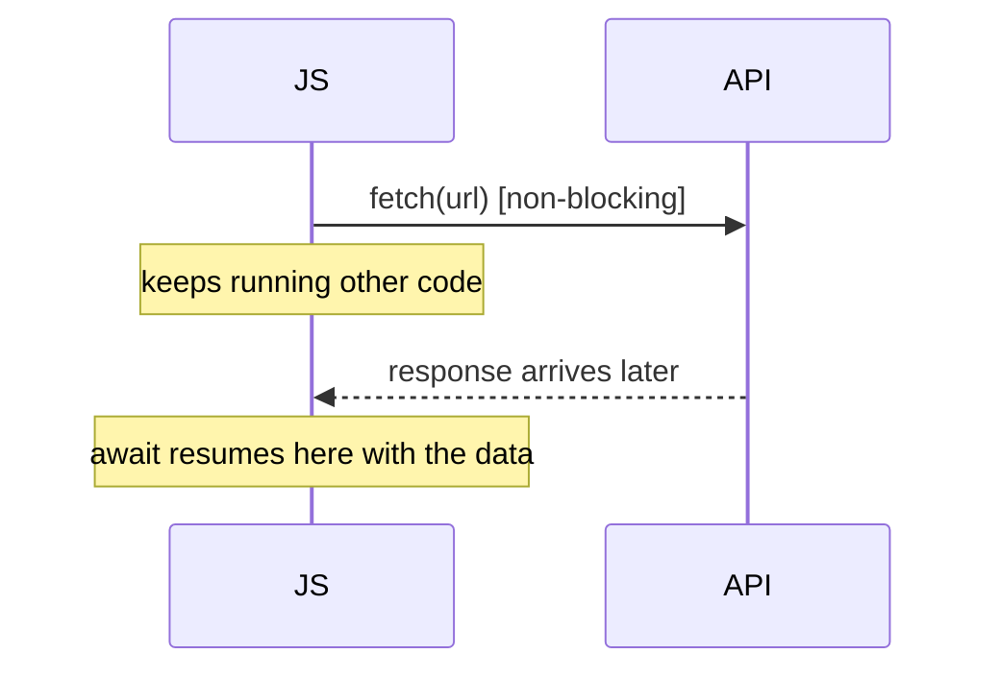

# Module 02 · Web Foundations

🎯 **Goal:** Understand what actually happens when you visit a website, then build an interactive page yourself with HTML, CSS, and JavaScript. This is the bedrock for MERN, web apps, and every AI app you'll deploy.

---

## 🧠 What happens when you open a website

You type a URL and hit Enter. A small miracle of coordination follows:



**Key vocabulary:**

| Term | Meaning |
|------|---------|
| **Client** | The browser (or app) making requests |
| **Server** | The computer that answers requests |
| **DNS** | The phonebook: domain name → IP address |
| **HTTP/HTTPS** | The language of requests/responses (S = secure/encrypted) |
| **Request** | "Please give me / do X" |
| **Response** | "Here's the result + a status code" |

**HTTP methods** (you'll use these everywhere, especially in APIs):

| Method | Means | Example |
|--------|-------|---------|
| GET | Read data | Load a page, fetch notes |
| POST | Create data | Submit a form, add a note |
| PUT/PATCH | Update data | Edit a note |
| DELETE | Remove data | Delete a note |

**Status codes** — the server's one-line mood:

| Code | Meaning |
|------|---------|
| 2xx | ✅ Success (200 OK, 201 Created) |
| 3xx | ↪️ Redirect |
| 4xx | 🙅 You messed up (404 Not Found, 401 Unauthorized, 403 Forbidden) |
| 5xx | 💥 Server messed up (500 Internal Server Error) |

---

## 🧠 The three languages of the front end

Every web page is three layers. The house analogy makes it stick:



| Layer | Question it answers | Example |
|-------|--------------------|---------|
| **HTML** | What's on the page? | headings, buttons, inputs |
| **CSS** | How does it look? | colors, layout, spacing |
| **JavaScript** | What does it *do*? | clicks, fetches, updates |

---

## ⌨️ HTML — the skeleton

Create `index.html`:
```html
<!DOCTYPE html>
<html lang="en">
<head>
  <meta charset="UTF-8" />
  <title>TaskVault</title>
  <link rel="stylesheet" href="style.css" />
</head>
<body>
  <h1>TaskVault</h1>
  <input id="taskInput" placeholder="What needs doing?" />
  <button id="addBtn">Add task</button>
  <ul id="taskList"></ul>

  <script src="app.js"></script>
</body>
</html>
```
Open it by double-clicking, or in VS Code use the **Live Server** extension (right-click → "Open with Live Server") so it auto-reloads.

**Tags you'll use daily:** `<div>` (box), `<h1>–<h6>` (headings), `<p>` (paragraph), `<a>` (link), ``, `<input>`, `<button>`, `<ul>/<li>` (lists), `<form>`.

---

## ⌨️ CSS — the skin

Create `style.css`:
```css
body {
  font-family: system-ui, sans-serif;
  max-width: 500px;
  margin: 40px auto;
  color: #1f2937;
}
button {
  background: #7c3aed;
  color: white;
  border: none;
  padding: 8px 16px;
  border-radius: 8px;
  cursor: pointer;
}
li { padding: 6px 0; border-bottom: 1px solid #e5e7eb; }
```

**The selector idea:** `body { }` styles all `<body>` content; `button { }` styles all buttons; `#addBtn { }` styles the element with `id="addBtn"`; `.done { }` styles elements with `class="done"`.

⚠️ **Gotcha — the box model.** Every element is a box of *content + padding + border + margin*. Layout confusion is almost always a box-model misunderstanding.



---

## ⌨️ JavaScript — the behavior (this is where it gets fun)

The browser turns your HTML into a tree of objects called the **DOM** (Document Object Model). JavaScript reads and changes that tree live — that's how pages become interactive.



Create `app.js`:
```javascript
// 1. Grab elements from the DOM
const input = document.getElementById("taskInput");
const button = document.getElementById("addBtn");
const list = document.getElementById("taskList");

// 2. Listen for a click
button.addEventListener("click", () => {
  const text = input.value.trim();
  if (!text) return;               // ignore empty

  // 3. Create a new <li> and add it to the list
  const li = document.createElement("li");
  li.textContent = text;
  li.addEventListener("click", () => li.classList.toggle("done"));
  list.appendChild(li);

  input.value = "";                // clear the box
});
```
Add to `style.css`: `.done { text-decoration: line-through; color: #9ca3af; }`

Now: type a task, click Add, see it appear; click a task to cross it off. **You built an interactive app with no framework.** React (Module 03) is just a smarter way to do exactly this.

---

## 🧠 JavaScript essentials you must internalize

| Concept | Snippet | Note |
|---------|---------|------|
| Variables | `const x = 1; let y = 2;` | `const` can't be reassigned; avoid `var` |
| Functions | `const add = (a,b) => a+b;` | arrow functions are everywhere |
| Arrays | `[1,2,3].map(n => n*2)` | `map/filter/reduce` are gold |
| Objects | `{ name: "Ada", age: 28 }` | key→value, like a record |
| Conditionals | `if (x) {...} else {...}` | |
| Async | `await fetch(url)` | how you call APIs — crucial for AI |

**Async is the one to actually understand**, because every AI/API call is async. JS doesn't freeze waiting for a slow network response; it registers a callback and keeps going.

```javascript
async function getData() {
  const res = await fetch("https://api.example.com/notes");
  const data = await res.json();   // parse JSON body
  console.log(data);
}
```



---

## 🛠️ Mini-project — Weather-or-not

Extend the page: add a button that fetches live data from a public API and shows it.
```javascript
async function getJoke() {
  const res = await fetch("https://official-joke-api.appspot.com/random_joke");
  const joke = await res.json();
  document.body.insertAdjacentHTML("beforeend",
    `<p>${joke.setup} <br/><em>${joke.punchline}</em></p>`);
}
```
Wire it to a new button. You've now: made an HTTP request, parsed JSON, and updated the DOM — the exact pattern behind every AI chat UI you'll build.

---

## ✅ You've mastered this when…

- [ ] You can explain client/server, DNS, request/response, and 3 status codes
- [ ] You can name the job of HTML vs CSS vs JS
- [ ] Your TaskVault page adds and crosses off tasks
- [ ] You used `fetch` + `await` to pull data from a public API
- [ ] You understand the DOM as a live tree your JS edits

**Next:** [03 · MERN Stack](03-MERN-Stack.md) — add a real backend, database, and React.
