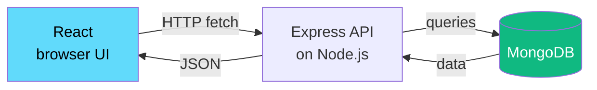
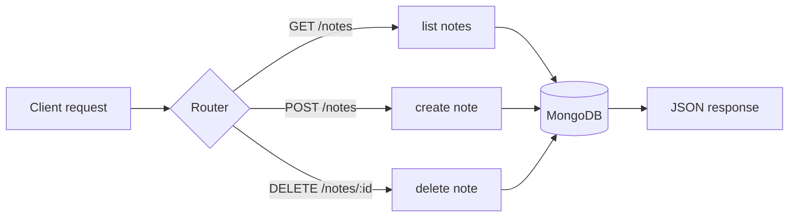
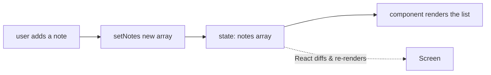
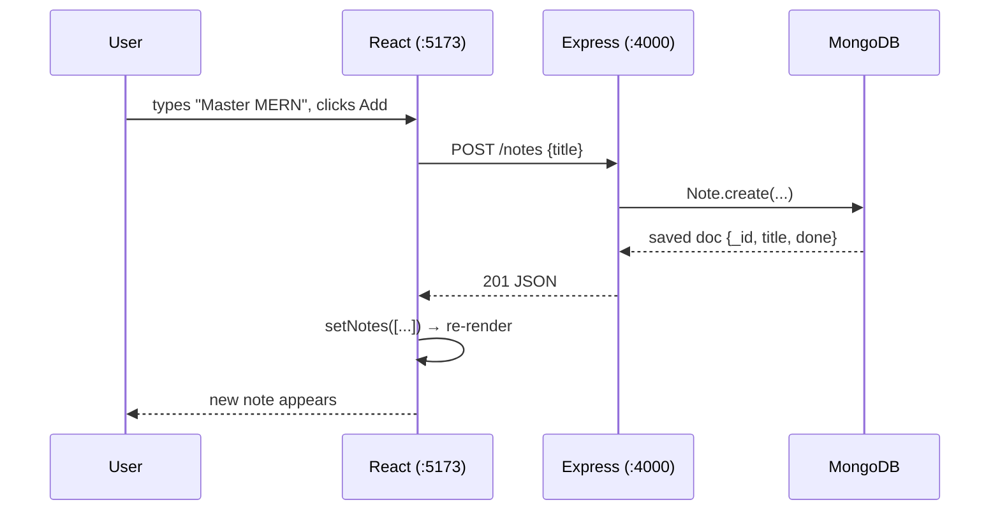

# Module 03 · MERN Stack

🎯 **Goal:** Build a real full-stack application — a database, a backend API, and a React front end that talk to each other. MERN is the most common JavaScript stack and the scaffolding your AI apps will live inside.

---

## 🧠 What MERN is

One language (JavaScript) across the whole stack. That's the appeal — you don't context-switch.

| Letter | Tech | Role | Layer |
|--------|------|------|-------|
| **M** | **MongoDB** | Database — stores your data | Data |
| **E** | **Express** | Web framework on Node — builds the API | Backend |
| **R** | **React** | UI library — builds the front end | Frontend |
| **N** | **Node.js** | Runtime — runs the backend JS | Backend |



**The flow in one sentence:** React asks Express for data over HTTP → Express reads/writes MongoDB → Express sends JSON back → React renders it.

---

## 🧠 Backend vs frontend — the dividing line

| | Frontend (React) | Backend (Express/Node) |
|---|---|---|
| Runs on | The user's browser | Your server |
| Sees | What the user sees | Database, secrets, API keys |
| Language | JS (+ JSX) | JS |
| Job | Display + capture input | Logic, data, auth, validation |
| Can be trusted? | ❌ Never — users can edit it | ✅ Yes — you control it |

⚠️ **The #1 security rule:** secrets (API keys, DB passwords) live **only** on the backend. Never put them in React — anyone can read browser code. Your AI API keys especially go server-side.

---

## ⌨️ Part A — MongoDB (the database)

MongoDB is a **NoSQL document database**: instead of rigid tables, it stores flexible JSON-like documents. A "note" is just an object.

```json
{
  "_id": "65f...",
  "title": "Learn LangGraph",
  "done": false,
  "createdAt": "2026-06-26T10:00:00Z"
}
```

**Setup the easy way:** create a free **MongoDB Atlas** cluster (cloud-hosted) at mongodb.com/atlas. It gives you a connection string like:
```
mongodb+srv://user:<password>@cluster0.xxxxx.mongodb.net/taskvault
```
Put that in a `.env` file (and `.gitignore` it!).

| SQL term | MongoDB term |
|----------|--------------|
| Table | Collection |
| Row | Document |
| Column | Field |

---

## ⌨️ Part B — Express + Node (the API)

```bash
mkdir taskvault-api && cd taskvault-api
npm init -y                                  # creates package.json
npm install express mongoose cors dotenv     # install deps
```

- **express** — the web server framework
- **mongoose** — translates JS objects ↔ MongoDB documents (an ODM)
- **cors** — lets your React app (different port) call this API
- **dotenv** — loads `.env` secrets

Create `server.js`:
```javascript
require("dotenv").config();
const express = require("express");
const mongoose = require("mongoose");
const cors = require("cors");

const app = express();
app.use(cors());
app.use(express.json());                      // parse JSON request bodies

// 1. Define the shape of a Note
const Note = mongoose.model("Note", {
  title: String,
  done: Boolean,
});

// 2. Routes = endpoints (the API surface)
app.get("/notes", async (req, res) => {
  const notes = await Note.find();
  res.json(notes);
});

app.post("/notes", async (req, res) => {
  const note = await Note.create({ title: req.body.title, done: false });
  res.status(201).json(note);
});

app.delete("/notes/:id", async (req, res) => {
  await Note.findByIdAndDelete(req.params.id);
  res.status(204).end();
});

// 3. Connect to DB, then start the server
mongoose.connect(process.env.MONGO_URI).then(() => {
  app.listen(4000, () => console.log("API on http://localhost:4000"));
});
```

Create `.env`:
```
MONGO_URI=mongodb+srv://user:<password>@cluster0.xxxxx.mongodb.net/taskvault
```

Run it: `node server.js`. Test in another terminal:
```bash
curl http://localhost:4000/notes                                   # GET (empty [])
curl -X POST http://localhost:4000/notes \
  -H "Content-Type: application/json" \
  -d '{"title":"Master MERN"}'                                      # POST
```

**This map — URL + method → function — is the heart of every backend, including AI ones:**



---

## ⌨️ Part C — React (the front end)

```bash
npm create vite@latest taskvault-ui -- --template react
cd taskvault-ui && npm install && npm run dev    # opens on :5173
```

**React's big idea:** your UI is a function of **state**. Change the state → React re-renders the affected parts automatically. No manual DOM editing like Module 02 — you describe *what* the UI should look like for a given state, React figures out *how*.



Replace `src/App.jsx`:
```jsx
import { useState, useEffect } from "react";

const API = "http://localhost:4000";

export default function App() {
  const [notes, setNotes] = useState([]);
  const [title, setTitle] = useState("");

  // load notes once on mount
  useEffect(() => {
    fetch(`${API}/notes`).then(r => r.json()).then(setNotes);
  }, []);

  async function addNote() {
    const res = await fetch(`${API}/notes`, {
      method: "POST",
      headers: { "Content-Type": "application/json" },
      body: JSON.stringify({ title }),
    });
    const newNote = await res.json();
    setNotes([...notes, newNote]);   // update state → UI re-renders
    setTitle("");
  }

  async function remove(id) {
    await fetch(`${API}/notes/${id}`, { method: "DELETE" });
    setNotes(notes.filter(n => n._id !== id));
  }

  return (
    <div style={{ maxWidth: 500, margin: "40px auto" }}>
      <h1>TaskVault</h1>
      <input value={title} onChange={e => setTitle(e.target.value)} />
      <button onClick={addNote}>Add</button>
      <ul>
        {notes.map(n => (
          <li key={n._id}>
            {n.title} <button onClick={() => remove(n._id)}>✕</button>
          </li>
        ))}
      </ul>
    </div>
  );
}
```

**Two hooks you'll use forever:**
- `useState` — holds data that changes; calling its setter triggers a re-render.
- `useEffect` — runs side effects (like fetching) at chosen times.

⚠️ **Gotcha — CORS errors.** If React can't reach the API ("blocked by CORS policy"), it's because they're on different ports. That's why we added `app.use(cors())` in Express. In production you'd lock CORS to your real domain.

---

## 🧠 The complete request, end to end



---

## 🛠️ Mini-project — full TaskVault

Wire all three together and add one feature: a **toggle done** button (PATCH `/notes/:id`). You'll need to:
1. Add a `PATCH` route in Express that flips `done`.
2. Add a button in React that calls it and updates state.
3. Style done items with a line-through.

When you can add, toggle, and delete notes that persist across page reloads (because they're in MongoDB), you've built a real full-stack app.

---

## ✅ You've mastered this when…

- [ ] You can explain each letter of MERN and which layer it's in
- [ ] Your API responds to GET/POST/DELETE and persists to MongoDB
- [ ] React loads, adds, and deletes notes via `fetch`
- [ ] You understand "UI = function of state" and used `useState`/`useEffect`
- [ ] You can articulate why secrets stay on the backend

**Next:** [04 · Build a Web App](04-Build-a-Web-App.md) — add auth, structure, and deploy it to the internet.
