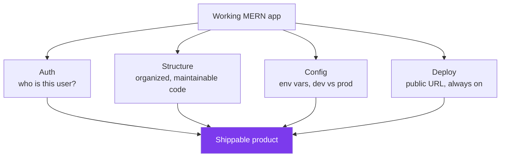
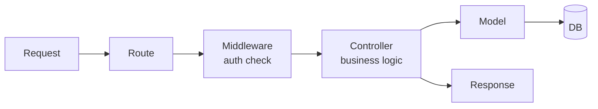
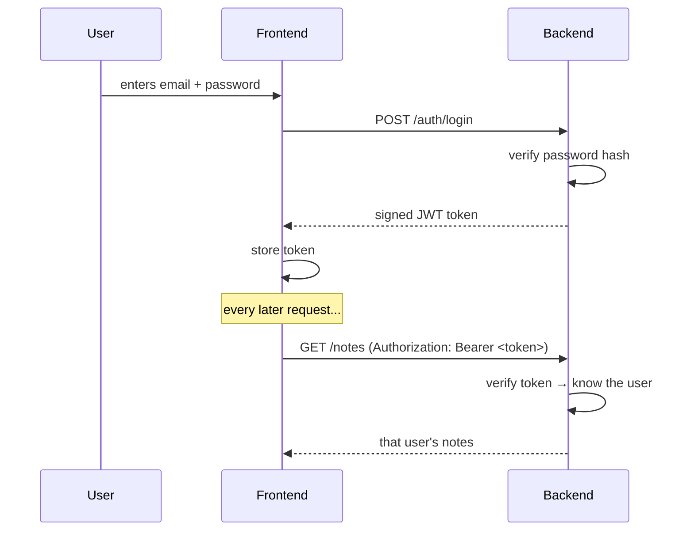
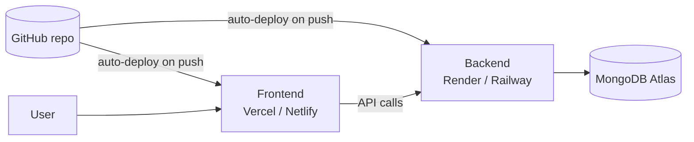
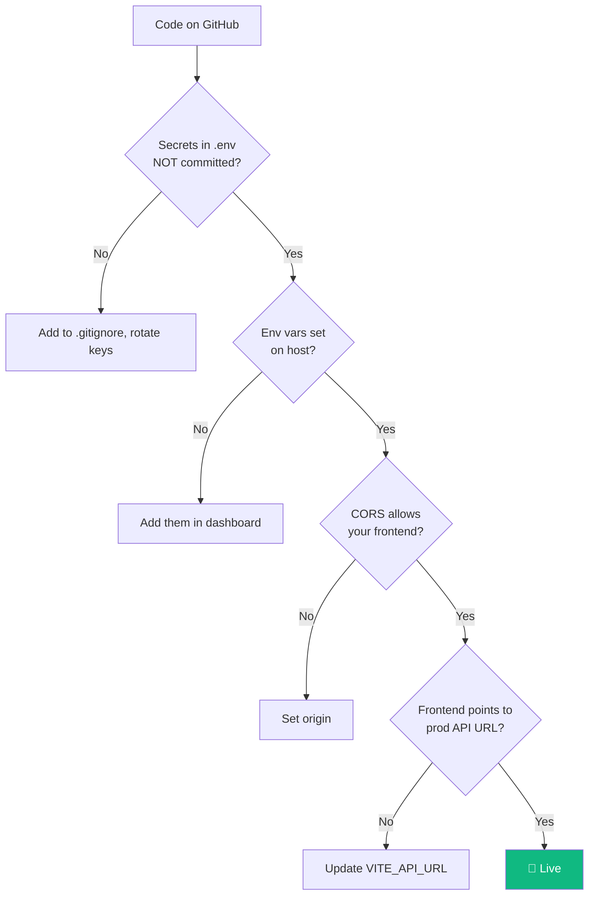

# Module 04 · Build a Web App (auth + structure + deploy)

🎯 **Goal:** Take TaskVault from "works on my machine" to "lives on the internet, with login." You'll learn project structure, authentication, environment config, and deployment — the difference between a toy and a product.

---

## 🧠 From script to product — what's missing

Your Module 03 app works but isn't shippable. Real apps add four things:



---

## 🧠 Project structure that scales

Stop dumping everything in `server.js`. Separate by responsibility:

```
taskvault-api/
├── src/
│   ├── models/        # Mongoose schemas (Note.js, User.js)
│   ├── routes/        # endpoint definitions (notes.js, auth.js)
│   ├── controllers/   # the logic for each route
│   ├── middleware/    # auth checks, error handling
│   └── server.js      # wires it all together
├── .env
├── .gitignore
└── package.json
```



**Why bother:** when your AI assistant has 30 endpoints and 5 agents, a flat file is unmaintainable. Separation of concerns is a habit you build now.

---

## 🧠 Authentication — proving who you are

Two distinct ideas people conflate:

| | **Authentication** | **Authorization** |
|---|---|---|
| Question | Who are you? | What are you allowed to do? |
| Example | Logging in | "Only admins can delete" |

**The modern token flow (JWT — JSON Web Token):**



**Two rules you must never break:**
1. **Never store plain passwords.** Hash them with `bcrypt`. Even you shouldn't be able to read them.
2. **A JWT is a signed claim, not a secret vault.** Anyone can decode it; they just can't forge it. Don't put secrets inside.

```javascript
// register: hash the password before saving
const bcrypt = require("bcrypt");
const hash = await bcrypt.hash(password, 10);
await User.create({ email, password: hash });

// login: compare + issue token
const jwt = require("jsonwebtoken");
const ok = await bcrypt.compare(password, user.password);
if (ok) {
  const token = jwt.sign({ userId: user._id }, process.env.JWT_SECRET, { expiresIn: "7d" });
  res.json({ token });
}

// middleware: protect routes
function auth(req, res, next) {
  const token = req.headers.authorization?.split(" ")[1];
  try {
    req.user = jwt.verify(token, process.env.JWT_SECRET);
    next();                              // allowed through
  } catch {
    res.status(401).json({ error: "Unauthorized" });
  }
}
// use it: app.get("/notes", auth, listNotes)
```

---

## 🧠 Environment config — dev vs prod

The same code runs in two worlds. Environment variables (`.env`) hold what differs.

| Variable | Dev | Prod |
|----------|-----|------|
| `MONGO_URI` | local/dev cluster | production cluster |
| `JWT_SECRET` | any string | long random secret |
| `PORT` | 4000 | set by host |
| `NODE_ENV` | `development` | `production` |

⚠️ **Gotcha:** Your local `.env` is git-ignored, so the deploy host has no idea what's in it. You re-enter these variables in the host's dashboard (Render/Railway/Vercel → Environment). Forgetting this is the #1 reason "it worked locally but the deploy crashed."

---

## ⌨️ Deployment — going live

A simple, modern split:



**Frontend (React)** → **Vercel** or **Netlify**:
```bash
npm run build              # creates an optimized /dist
# push to GitHub, connect the repo in Vercel, it builds & hosts automatically
```

**Backend (Express)** → **Render** or **Railway**:
- Connect your GitHub repo, set the start command (`node src/server.js`), add the env vars, deploy.
- You get a public URL like `https://taskvault-api.onrender.com`.

**Then update the frontend** to call the live API URL (via its own env var, e.g. `VITE_API_URL`), not `localhost`.

⚠️ **Gotcha — production CORS.** Now lock it down: `app.use(cors({ origin: "https://taskvault.vercel.app" }))` so only your real frontend can call the API.

---

## 🧠 The deploy mental checklist



---

## 🛠️ Mini-project — ship TaskVault for real

1. Restructure the API into `models/routes/controllers/middleware`.
2. Add `User` model + `/auth/register` and `/auth/login` with bcrypt + JWT.
3. Protect all `/notes` routes so users only see *their own* notes (filter by `req.user.userId`).
4. Deploy backend to Render, frontend to Vercel, DB on Atlas.
5. Send the live link to a friend and have them sign up.

**When a stranger can create an account and their notes are private, you've shipped a product.** This is the container your AI assistant capstone will live in.

---

## ✅ You've mastered this when…

- [ ] Your code is split into models/routes/controllers/middleware
- [ ] Passwords are bcrypt-hashed; auth uses JWT middleware
- [ ] Each user sees only their own data
- [ ] The app is deployed and reachable on a public URL
- [ ] You can list the 4-step deploy checklist from memory

**Next:** [05 · Automation](05-Automation.md) — make programs do work for you on a schedule and in response to events.
