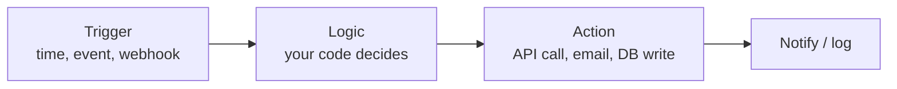
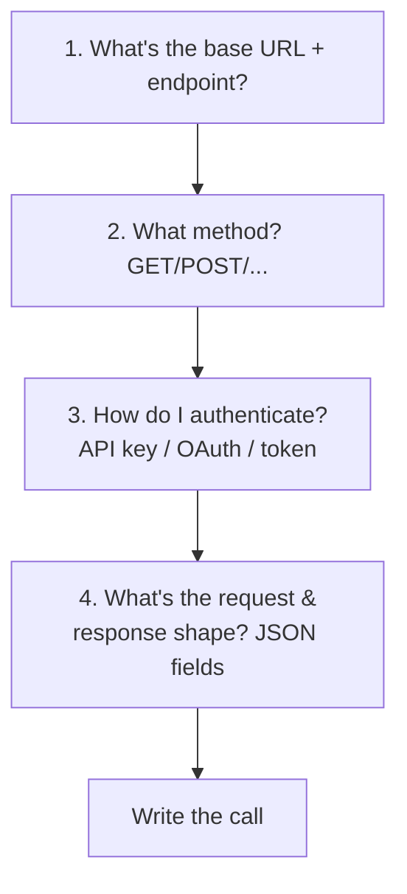
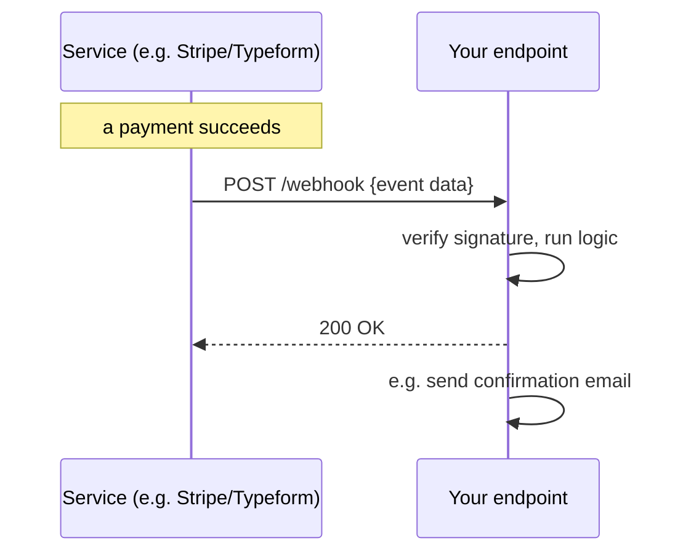
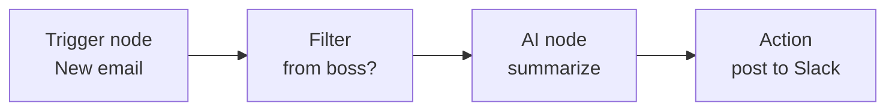
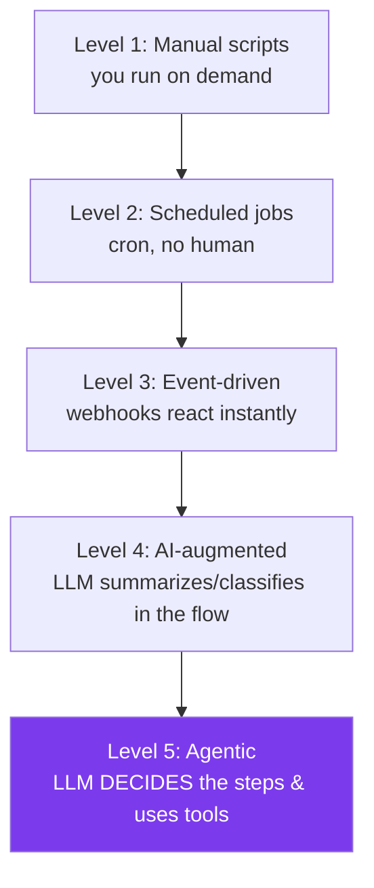

# Module 05 · Automation

🎯 **Goal:** Make programs do repetitive work for you — call other services' APIs, react to events with webhooks, run jobs on a schedule, and wire multi-step workflows. This is the bridge from "websites" to "agents that act." It's also the foundation of automating real-world workflows efficiently.

---

## 🧠 What automation actually is

Automation = **trigger → logic → action**, with no human in the middle for the routine path.



An **AI agent is this exact shape** — just with an LLM in the "logic" box deciding what to do. Master this and agents stop being mysterious.

| Trigger type | Means | Example |
|--------------|-------|---------|
| **Scheduled** | "Every day at 9am" | Daily report |
| **Event/Webhook** | "When X happens, call me" | New form submission → Slack ping |
| **Manual** | "When I run it" | One-off data cleanup |
| **Polling** | "Check every N minutes" | Watch a folder/inbox |

---

## ⌨️ Part A — Calling APIs (the core skill)

Almost all automation is gluing APIs together. An **API key** authenticates you; you send a request, you get JSON.

```python
import requests, os

resp = requests.get(
    "https://api.github.com/users/yourname/repos",
    headers={"Authorization": f"Bearer {os.environ['GH_TOKEN']}"}
)
repos = resp.json()
for r in repos:
    print(r["name"], "⭐", r["stargazers_count"])
```

Or in Node:
```javascript
const resp = await fetch("https://api.github.com/users/yourname/repos", {
  headers: { Authorization: `Bearer ${process.env.GH_TOKEN}` },
});
const repos = await resp.json();
```

**Reading any API's docs — the 4 questions:**



⚠️ **Gotchas:** rate limits (you'll get `429 Too Many Requests` — add delays/retries), pagination (results come in pages — loop until done), and expiring tokens.

---

## 🧠 Part B — Webhooks (event-driven)

A webhook is a reverse API call: instead of *you* asking repeatedly, the other service **calls your URL** the instant something happens. Efficient and real-time.



Your webhook receiver is just an Express POST route:
```javascript
app.post("/webhook", express.json(), (req, res) => {
  const event = req.body;
  if (event.type === "payment.succeeded") {
    // do something: email, DB update, Slack message
  }
  res.sendStatus(200);     // ALWAYS acknowledge fast
});
```
⚠️ **Verify signatures.** Real webhook providers sign their payloads. Always verify, or anyone can fake events to your endpoint. To test locally, use a tunnel like **ngrok** to expose `localhost` to the internet.

---

## 🧠 Part C — Scheduling (time-driven)

**Cron** is the universal "run at this time" syntax.

```
┌─ minute (0-59)
│ ┌─ hour (0-23)
│ │ ┌─ day of month
│ │ │ ┌─ month
│ │ │ │ ┌─ day of week
│ │ │ │ │
0 9 * * 1   →  every Monday at 09:00
*/15 * * * * →  every 15 minutes
0 0 1 * *    →  midnight on the 1st of each month
```

In code (Node, `node-cron`):
```javascript
const cron = require("node-cron");
cron.schedule("0 9 * * 1", () => sendWeeklyReport());   // Mon 9am
```
In production you'd use a host's scheduler (Render Cron Jobs, GitHub Actions `on: schedule`, cloud functions).

---

## 🧠 Part D — Workflow tools (low-code glue)

Before writing code, know that **n8n / Make / Zapier** let you wire triggers→actions visually. Great for non-critical glue; you graduate to code when you need version control, testing, and complex logic.



| Approach | Best when | Trade-off |
|----------|-----------|-----------|
| **Code** (Node/Python) | Complex, testable, versioned, scale | More effort |
| **n8n** (open-source) | Self-hosted visual workflows, AI nodes | Some limits |
| **Zapier/Make** | Quick non-technical glue | Cost, less control |

**n8n matters for your path:** it's open-source, self-hostable, and has native AI/LangChain nodes — a fast way to prototype agentic automations before coding them.

---

## 🧠 The automation pyramid (where AI fits)



Modules 06–12 are about climbing from Level 4 to Level 5.

---

## 🛠️ Mini-project — the scheduled report bot

Build a script that, on a schedule, pulls data and posts a summary:
1. **Trigger:** cron, every weekday at 8am.
2. **Logic:** fetch from a public API (e.g. weather, or GitHub stars on your repo, or an RSS feed).
3. **Action:** format a short message and post it to a Slack/Discord webhook (both give you a free incoming-webhook URL — paste it, POST JSON to it).
4. Deploy it as a Render Cron Job or GitHub Action so it runs without your laptop on.

```javascript
async function run() {
  const data = await fetch("https://api.github.com/repos/yourname/taskvault").then(r => r.json());
  await fetch(process.env.SLACK_WEBHOOK, {
    method: "POST",
    headers: { "Content-Type": "application/json" },
    body: JSON.stringify({ text: `⭐ TaskVault now has ${data.stargazers_count} stars` }),
  });
}
```

You just built a Level 2–3 automation. Swap the "logic" for an LLM next module and it becomes AI.

---

## ✅ You've mastered this when…

- [ ] You can call any documented REST API with auth from code
- [ ] You built a webhook receiver and understand signature verification
- [ ] You can read/write a cron expression
- [ ] Your report bot runs on a schedule without your machine on
- [ ] You can place a given task on the 5-level automation pyramid

**Next:** [06 · AI Foundations](06-AI-Foundations.md) — LLMs, prompting, embeddings, and RAG.
