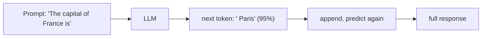
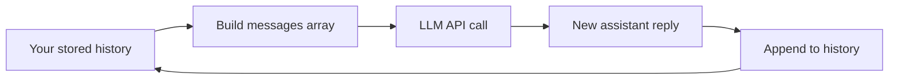
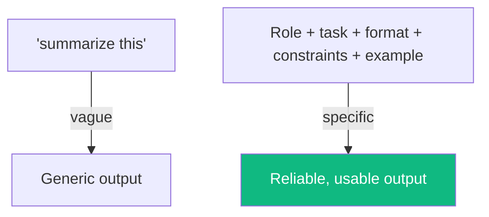
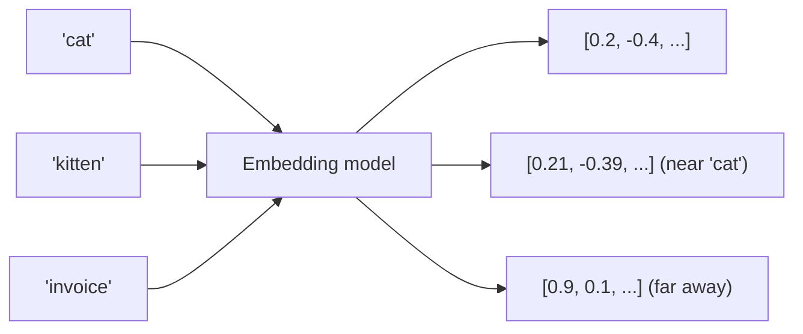
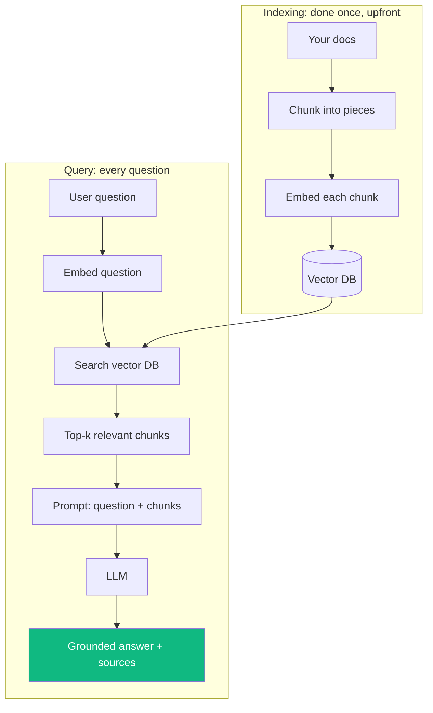

# Module 06 · AI Foundations

🎯 **Goal:** Understand what an LLM really is and isn't, call one from code, prompt it well, and build the single most important AI pattern: RAG (Retrieval-Augmented Generation) — "chat with your own documents."

> This module is the *builder's* view of LLMs: enough theory to use them correctly, then straight into hands-on building.

---

## 🧠 What an LLM is (the honest version)

A Large Language Model is a function that, given some text, predicts the most likely next chunk of text — over and over. That's it. Everything impressive emerges from doing that extremely well at massive scale.



**What follows from this mental model:**

| Because it's a next-token predictor… | Implication for you |
|--------------------------------------|---------------------|
| It has no live knowledge | It has a **training cutoff**; give it fresh data via tools/RAG |
| It predicts plausible text | It can **hallucinate** confidently — verify facts |
| It has no memory between calls | **You** must pass context each time |
| It's probabilistic | Same prompt can give different answers (controlled by `temperature`) |
| It reasons in text | "Think step by step" genuinely helps |

**Tokens** are the chunks (≈¾ of a word). You pay per token, and every model has a **context window** (max tokens it can see at once). Budgeting tokens is a real engineering concern.

---

## ⌨️ Calling an LLM from code

The API shape is nearly identical across providers (Anthropic, OpenAI, etc.): you send **messages**, you get a **completion**.

```python
# pip install anthropic
from anthropic import Anthropic
client = Anthropic()    # reads ANTHROPIC_API_KEY from env

msg = client.messages.create(
    model="claude-sonnet-4-6",
    max_tokens=500,
    messages=[{"role": "user", "content": "Explain RAG in 2 sentences."}],
)
print(msg.content[0].text)
```

**The message roles:**

| Role | Purpose |
|------|---------|
| `system` | The standing instructions / persona / rules |
| `user` | What the human said |
| `assistant` | What the model said (you include past turns for memory) |

⚠️ **Gotcha — the model is stateless.** To have a "conversation," you resend the whole message history every call. The "memory" is something *you* maintain.



---

## 🧠 Prompting that actually works

The difference between mediocre and great LLM output is mostly prompt quality. The reliable levers:

| Technique | What | Example |
|-----------|------|---------|
| **Role/context** | Tell it who it is & the situation | "You are a senior PM reviewing a spec." |
| **Be specific** | Constrain format, length, audience | "Reply as 3 bullet points, for executives." |
| **Examples (few-shot)** | Show 1–3 input→output pairs | demonstrate the pattern |
| **Chain-of-thought** | Ask it to reason before answering | "Think step by step, then give the answer." |
| **Structured output** | Demand JSON / a schema | "Return JSON: {sentiment, score}" |
| **Guardrails** | State what NOT to do, how to handle unknowns | "If unsure, say 'I don't know.'" |



**Temperature** controls randomness: `0` = focused/deterministic (good for extraction, code), `~0.7` = creative (brainstorming, writing).

---

## 🧠 Embeddings — turning meaning into math

This is the unlock for search, RAG, and memory. An **embedding** converts text into a vector (a long list of numbers) where *similar meanings sit close together* in space.



You measure closeness with **cosine similarity**. This lets you ask "which of my 10,000 documents is most relevant to this question?" — by math, not keywords.

```python
from anthropic import Anthropic   # or voyageai / openai embeddings
# embeddings: text -> vector; store vectors in a vector DB
# then: query_vector vs stored_vectors -> nearest = most relevant
```

A **vector database** (Chroma, Pinecone, pgvector, Weaviate) stores these vectors and finds nearest neighbors fast.

---

## 🧠 RAG — Retrieval-Augmented Generation (the big one)

LLMs don't know *your* data and can hallucinate. RAG fixes both: **retrieve** relevant facts first, then ask the LLM to answer **using only those facts**.



**Why RAG matters more than fine-tuning for most apps:**

| | RAG | Fine-tuning |
|---|-----|-------------|
| Adds new *knowledge* | ✅ Easy, update anytime | ❌ Expensive, static |
| Adds new *behavior/style* | ⚠️ Limited | ✅ Good |
| Cost to update | Re-embed docs | Re-train |
| Shows sources | ✅ Yes | ❌ No |
| Best for | "Answer from my data" | "Always respond in this format/voice" |

⚠️ **Gotchas:** chunk size matters (too big = noisy, too small = lost context; ~300–800 tokens is common); always return **sources** so answers are verifiable; retrieval quality caps answer quality ("garbage retrieved → garbage answer").

---

## 🛠️ Mini-project — "Chat with your docs"

Build a minimal RAG app over a folder of your own notes or markdown files:
1. **Load & chunk:** read your `.md` files, split into ~500-token chunks.
2. **Embed & store:** embed each chunk, store in **Chroma** (local, `pip install chromadb`).
3. **Query:** embed the user's question, retrieve top-4 chunks.
4. **Answer:** prompt the LLM with question + chunks + "Answer only from this context; cite the file."
5. Ask it: *"What did I learn about multi-agent failure modes?"* — and watch it answer from YOUR notes.

```python
# skeleton
import chromadb
db = chromadb.Client().create_collection("notes")
db.add(documents=chunks, ids=[f"c{i}" for i in range(len(chunks))])
hits = db.query(query_texts=[question], n_results=4)
context = "\n\n".join(hits["documents"][0])
# then send question + context to the LLM
```

This is the foundational pattern under most "AI assistant" products. Your capstone will extend it.

---

## ✅ You've mastered this when…

- [ ] You can explain "next-token predictor" and 3 consequences (hallucination, cutoff, statelessness)
- [ ] You called an LLM API and maintained a multi-turn conversation
- [ ] You can name 4 prompting techniques and when to use temperature 0 vs 0.7
- [ ] You can explain embeddings + cosine similarity in plain words
- [ ] Your RAG app answers questions from your own notes with sources

**Next:** [07 · Agents & Architecture](07-Agents-and-Architecture.md) — give the LLM tools and a loop, and let it *act*.
