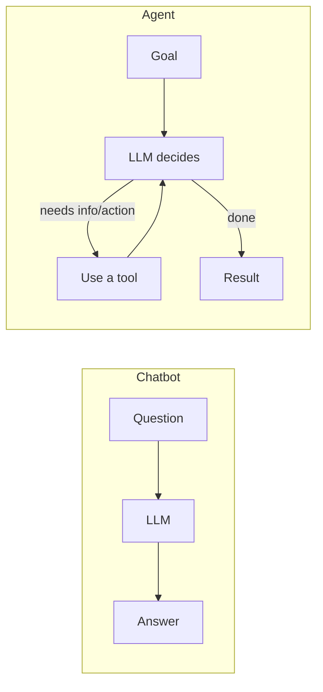
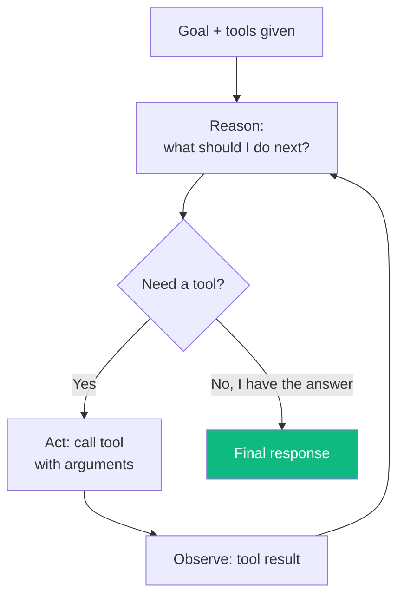
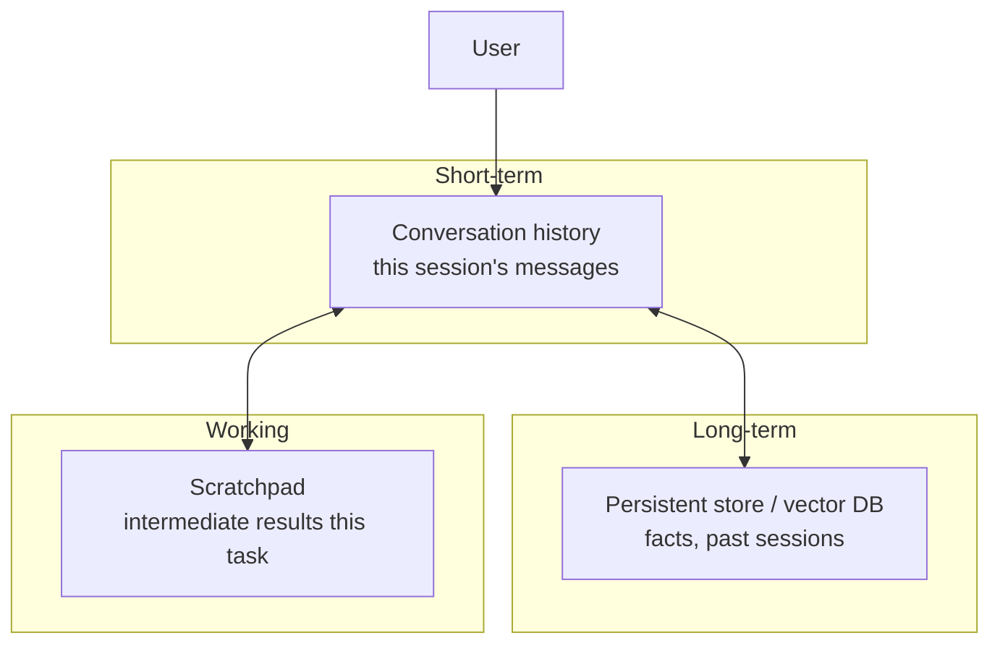
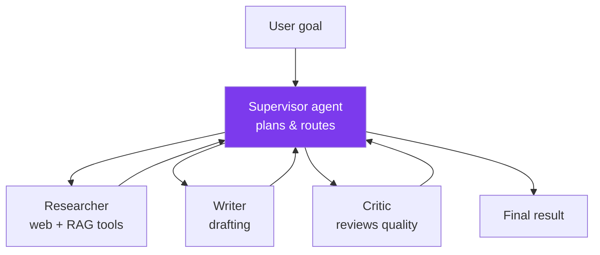
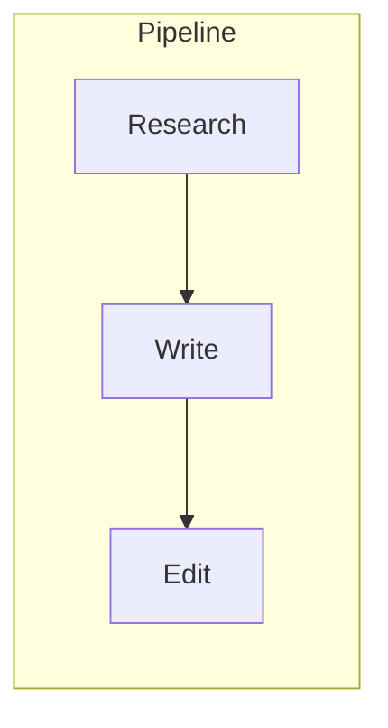
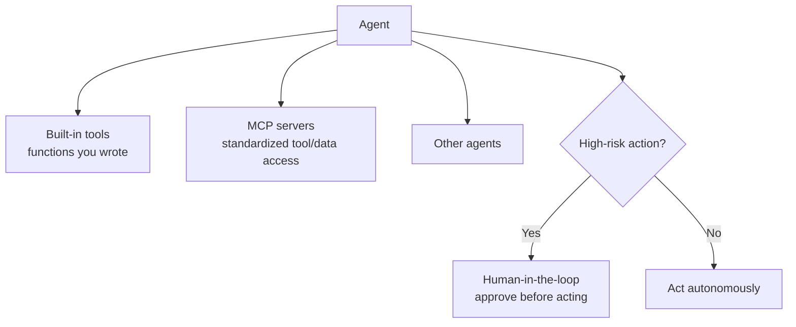

# Module 07 · Agents & Architecture

🎯 **Goal:** Understand what makes an "agent" different from a chatbot, build the agent loop with tools and memory from scratch, then design multi-agent architectures. This is the conceptual core — the frameworks in Modules 08–09 are just ergonomic wrappers around what you'll build by hand here.

> This module turns agent concepts into *code you write* — the patterns the frameworks in Modules 08–09 assume you already understand.

---

## 🧠 Chatbot vs Agent



| | Chatbot | Agent |
|---|---------|-------|
| Does | Answers from its head | Pursues a goal, takes actions |
| Tools | None | Calls functions/APIs/other agents |
| Steps | One shot | Loops until done |
| Example | "What's RAG?" | "Research RAG, summarize 3 sources, save to a file" |

**The definition to hold:** an agent is **an LLM in a loop with tools and memory, pursuing a goal.**

---

## 🧠 The agent loop (ReAct: Reason + Act)

The dominant pattern. The model alternates between thinking and acting until it decides it's finished.



**The 4 ingredients:**

| Ingredient | Role | In code |
|------------|------|---------|
| **LLM** | The reasoning engine | API call |
| **Tools** | Hands — what it can DO | functions with descriptions |
| **Memory** | Context across steps/sessions | message history + storage |
| **Loop / orchestration** | Keeps it going until done | your `while` loop or a framework |

---

## ⌨️ Build a tiny agent from scratch (no framework)

This 40-line loop is genuinely how agents work. Frameworks add convenience, not magic.

```python
import json
from anthropic import Anthropic
client = Anthropic()

# 1. Define tools as real functions
def get_weather(city):
    return f"{city}: 28°C, sunny"   # pretend API
def calculator(expression):
    return str(eval(expression))    # (sandbox in real life!)

TOOLS = {
    "get_weather": {"fn": get_weather, "desc": "Get weather for a city. arg: city"},
    "calculator":  {"fn": calculator,  "desc": "Evaluate math. arg: expression"},
}

# 2. The loop
def run_agent(goal):
    messages = [{"role": "user", "content": goal}]
    tool_list = [
        {"name": k, "description": v["desc"],
         "input_schema": {"type": "object", "properties": {"arg": {"type": "string"}}}}
        for k, v in TOOLS.items()
    ]
    while True:
        resp = client.messages.create(
            model="claude-sonnet-4-6", max_tokens=1000,
            messages=messages, tools=tool_list,
        )
        if resp.stop_reason == "tool_use":          # model wants to act
            for block in resp.content:
                if block.type == "tool_use":
                    result = TOOLS[block.name]["fn"](block.input["arg"])
                    messages.append({"role": "assistant", "content": resp.content})
                    messages.append({"role": "user", "content": [
                        {"type": "tool_result", "tool_use_id": block.id, "content": result}
                    ]})
        else:                                        # model is done
            return resp.content[0].text

print(run_agent("What's the weather in Tokyo, and what's 23*19?"))
```

**Trace of what happens:** model reasons → calls `get_weather("Tokyo")` → observes "28°C" → calls `calculator("23*19")` → observes "437" → writes final answer. You just watched ReAct execute.

---

## 🧠 Memory — the three kinds



| Type | Lives for | Example | Built with |
|------|-----------|---------|------------|
| Short-term | One session | The chat so far | messages array |
| Working | One task | "found 3 sources, now summarizing" | variables/state |
| Long-term | Forever | "User prefers concise answers" | DB / vector store (RAG over memory) |

⚠️ **Context window is finite.** You can't keep stuffing history in forever. Strategies: summarize old turns, retrieve only relevant memories (RAG), or use the framework's memory manager.

---

## 🧠 Multi-agent architecture

When one agent's job gets too big or needs different specialties, you split it into a team. The dominant pattern is **supervisor / orchestrator → workers**.



**Common topologies:**

| Pattern | Shape | Use when |
|---------|-------|----------|
| **Single agent** | one loop | task fits one role |
| **Supervisor → workers** | hub & spoke | distinct sub-tasks, central control |
| **Sequential pipeline** | A→B→C | clear stages (research→write→edit) |
| **Hierarchical** | supervisors of supervisors | large, decomposable problems |
| **Network/swarm** | agents talk peer-to-peer | exploratory, less common |



⚠️ **Multi-agent failure modes:** error compounding across hops, agents talking past each other, runaway loops/cost, and lost context between agents. **Rule of thumb: don't reach for multi-agent until a single agent demonstrably can't do the job.** Complexity has a real cost.

---

## 🧠 Where tools, MCP, and humans fit



- **MCP (Model Context Protocol)** — the standard way to give agents tools and data. Think "USB-C for AI tools."
- **HITL (Human-in-the-loop)** — gate risky actions (sending money, deleting data, emailing customers) behind human approval. Match autonomy to risk.

---

## 🛠️ Mini-project — a research agent

Extend your scratch-built agent with real tools:
1. **`web_search(query)`** — call a search API (Tavily, Brave, or SerpAPI have simple APIs).
2. **`read_url(url)`** — fetch and extract page text.
3. **`save_note(text)`** — append to a markdown file.
4. Give it the goal: *"Research the latest on LangGraph, summarize the 3 most important features, and save a note with sources."*
5. Watch the loop: search → read → read → summarize → save. Add a `max_steps` guard so it can't loop forever.

When your agent autonomously chains search→read→write to complete a goal, you understand agents at the level the frameworks assume.

---

## ✅ You've mastered this when…

- [ ] You can explain the ReAct loop and its 4 ingredients without notes
- [ ] You built and ran an agent loop from scratch with ≥2 tools
- [ ] You can distinguish short-term, working, and long-term memory
- [ ] You can sketch supervisor, pipeline, and hierarchical topologies
- [ ] You can name 3 multi-agent failure modes and the "don't over-engineer" rule

**Next:** [08 · LangChain](08-LangChain.md) — the framework that gives you these pieces pre-built.
