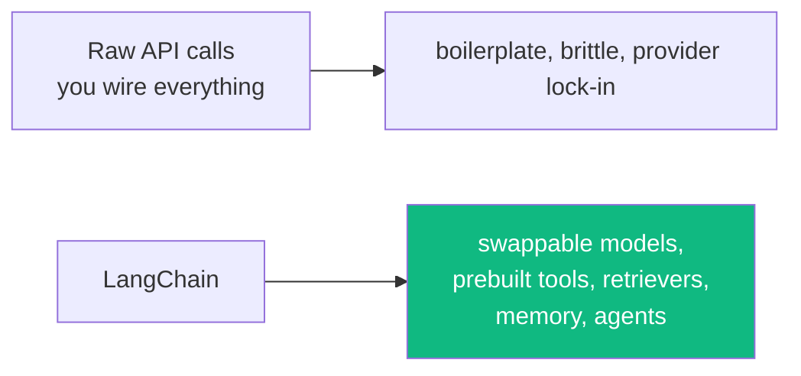
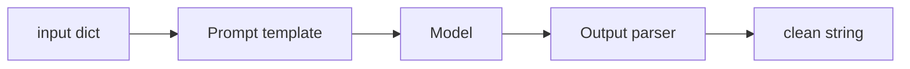
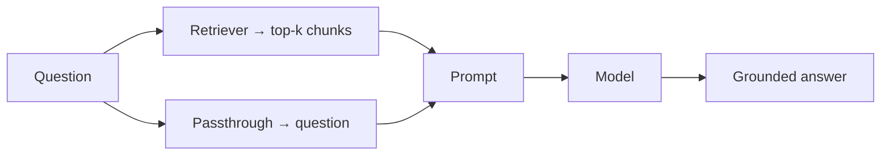
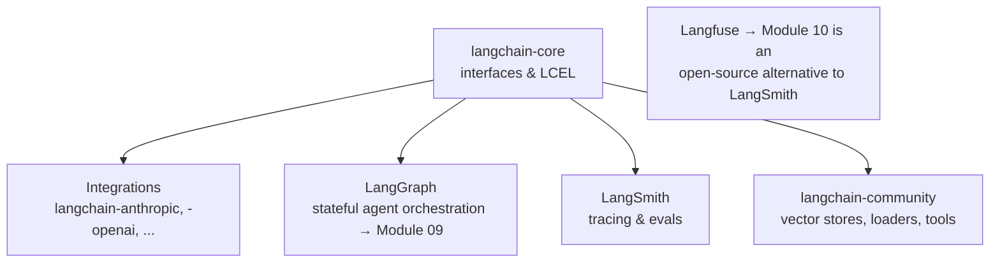

# Module 08 · LangChain

🎯 **Goal:** Use the most popular LLM framework to compose chains, connect tools, build retrievers, and stop writing boilerplate. You'll re-build your Module 06–07 projects faster and more robustly.

> **Version note (mid-2025+):** LangChain reached **v1.0** in October 2025. Modern LangChain agents are actually built *on LangGraph* under the hood — so this module and Module 09 are two views of one ecosystem. Start high-level here; drop to LangGraph when you need control.

---

## 🧠 Why a framework at all

In Module 07 you hand-wrote the agent loop, message plumbing, and tool wiring. That's essential for understanding — but tedious to repeat. LangChain gives you battle-tested, swappable building blocks.



⚠️ **Honest caveat:** LangChain moves fast and has a learning curve; its abstractions can hide what's happening. Because you built the loop by hand first, you'll see *through* the abstractions instead of being trapped by them.

---

## 🧠 The core building blocks

| Block | What it does | Replaces your hand-built… |
|-------|--------------|---------------------------|
| **Model** | Unified interface to any LLM | raw API call |
| **Prompt template** | Reusable, parameterized prompts | f-strings |
| **Output parser** | Force structured output (JSON/objects) | manual parsing |
| **Chain (LCEL)** | Pipe steps together with `\|` | your glue code |
| **Tool** | A function the model can call | your TOOLS dict |
| **Retriever** | Pluggable RAG search | your Chroma query |
| **Memory** | Conversation/state persistence | your messages array |
| **Agent** | The reasoning loop (now via LangGraph) | your `while` loop |

---

## ⌨️ LCEL — composing with pipes

LangChain Expression Language lets you wire components like Unix pipes: output of one flows into the next.

```python
# pip install langchain langchain-anthropic
from langchain_anthropic import ChatAnthropic
from langchain_core.prompts import ChatPromptTemplate
from langchain_core.output_parsers import StrOutputParser

model = ChatAnthropic(model="claude-sonnet-4-6")
prompt = ChatPromptTemplate.from_template(
    "Summarize this for a {audience} in 2 sentences:\n\n{text}"
)

chain = prompt | model | StrOutputParser()      # the pipe = a chain

result = chain.invoke({"audience": "executive", "text": "..."} )
print(result)
```



**Why this is powerful:** every piece is swappable. Change `ChatAnthropic` to another provider, or insert a retriever, without rewriting the flow.

---

## ⌨️ RAG in LangChain (compare to your Module 06 build)

```python
from langchain_community.vectorstores import Chroma
from langchain_anthropic import ChatAnthropic
from langchain_core.prompts import ChatPromptTemplate
from langchain_core.runnables import RunnablePassthrough

# (docs already loaded, split, embedded into Chroma)
retriever = vectorstore.as_retriever(search_kwargs={"k": 4})

prompt = ChatPromptTemplate.from_template(
    "Answer using ONLY this context. Cite sources.\n\nContext:\n{context}\n\nQ: {question}"
)
model = ChatAnthropic(model="claude-sonnet-4-6")

rag_chain = (
    {"context": retriever, "question": RunnablePassthrough()}
    | prompt | model
)
print(rag_chain.invoke("What are multi-agent failure modes?").content)
```

The whole RAG pipeline from Module 06 — now four composable lines. Same concept, less plumbing.



---

## ⌨️ Tools & agents

```python
from langchain_core.tools import tool
from langgraph.prebuilt import create_react_agent     # modern LangChain agents live here
from langchain_anthropic import ChatAnthropic

@tool
def get_weather(city: str) -> str:
    """Get the current weather for a city."""
    return f"{city}: 28°C, sunny"

@tool
def calculator(expression: str) -> str:
    """Evaluate a math expression."""
    return str(eval(expression))

agent = create_react_agent(ChatAnthropic(model="claude-sonnet-4-6"),
                           tools=[get_weather, calculator])

result = agent.invoke({"messages": [("user", "Weather in Tokyo and 23*19?")]})
print(result["messages"][-1].content)
```

Notice: the `@tool` decorator turns a typed, docstringed function into something the model can call — the docstring *is* the description the LLM reads. **Write good docstrings; they're prompts.**

---

## 🧠 The LangChain ecosystem map



| Piece | Role |
|-------|------|
| `langchain-core` | The base abstractions + LCEL |
| Integration packages | Providers, vector stores, tools |
| **LangGraph** | When you need loops, branches, multi-agent (Module 09) |
| **LangSmith** | LangChain's own tracing/eval (commercial) |
| **Langfuse** | Open-source observability you'll use in Module 10 |

---

## 🛠️ Mini-project — rebuild + extend

1. Re-implement your Module 06 "chat with your docs" RAG entirely in LangChain.
2. Add a tool-using agent that can both **answer from your notes (retriever)** and **do math / fetch a URL**.
3. Add conversation memory so follow-up questions work ("and summarize that more briefly").
4. Compare: how many lines vs your from-scratch version? What got easier, what got hidden?

That reflection — what the framework gives vs hides — is the real learning.

---

## ✅ You've mastered this when…

- [ ] You can build a `prompt | model | parser` chain with LCEL
- [ ] You rebuilt RAG using a retriever in a chain
- [ ] You created tools with `@tool` and ran a react agent
- [ ] You can place LangChain, LangGraph, LangSmith, Langfuse on the ecosystem map
- [ ] You can articulate one thing the framework hides that you're glad you understand

**Next:** [09 · LangGraph](09-LangGraph.md) — when straight chains aren't enough: state, loops, branches, and real multi-agent control.
