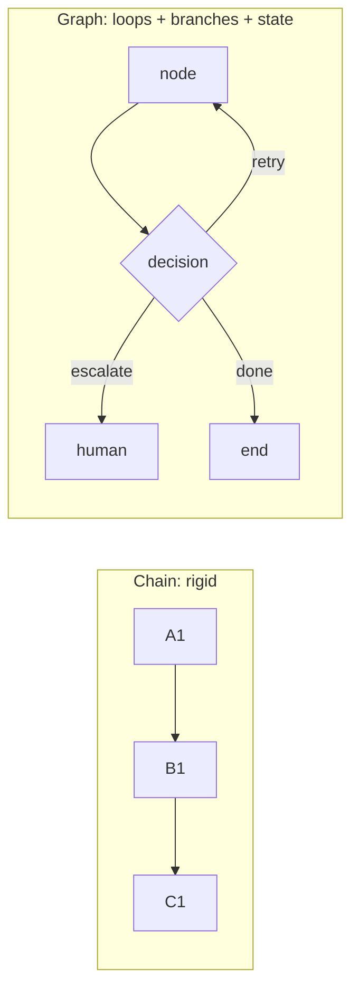
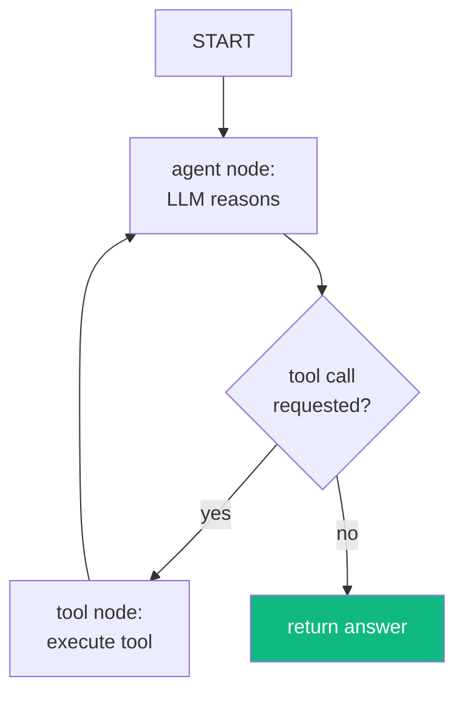
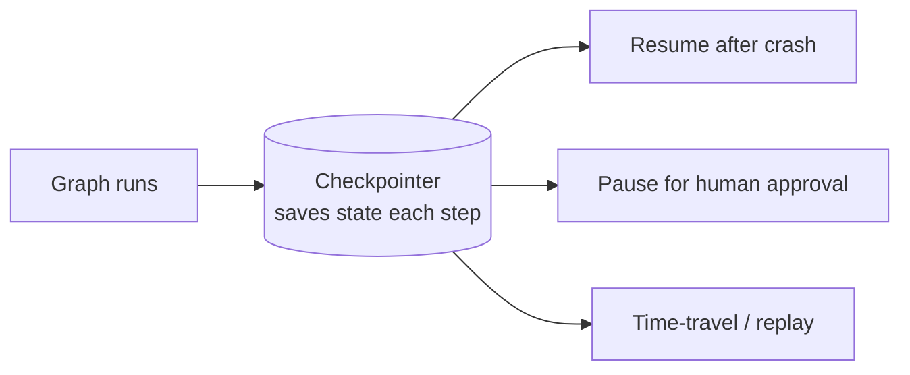
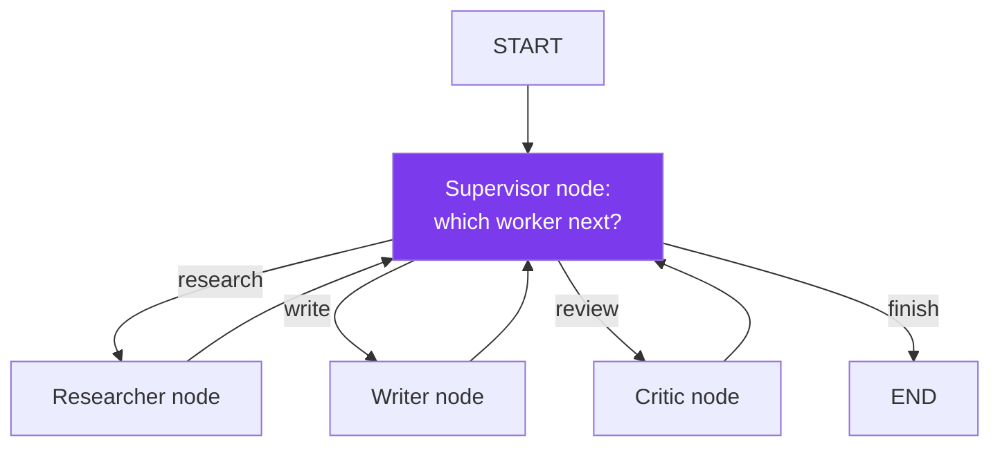
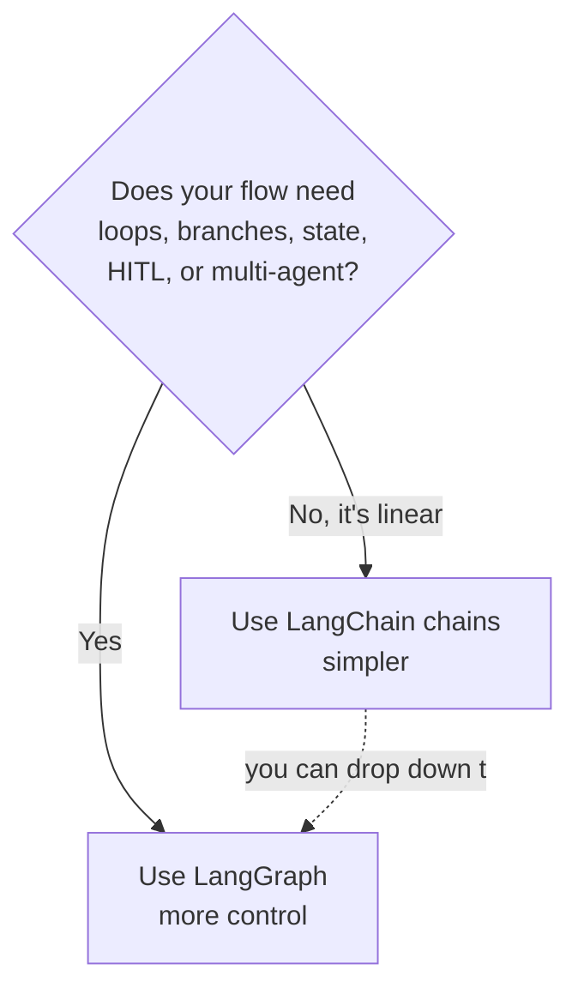

# Module 09 · LangGraph

🎯 **Goal:** Build agents that have **state**, can **loop and branch**, support **human-in-the-loop**, and **coordinate multiple agents** — reliably enough for production. This is where serious agentic systems are built.

> **Version note:** LangGraph reached **v1.0 in October 2025** (production-ready, durable state, first-class HITL). Modern LangChain agents are built on it. Python and JS/TS both supported; examples here are Python.

---

## 🧠 Why graphs, not chains

A chain (Module 08) is a straight line: A→B→C. But real agents need to **loop** ("keep researching until you have enough"), **branch** ("if the answer is uncertain, ask a human"), and **remember state** across steps. That's a **graph**, not a line.



**The core idea:** you model your agent as a **graph** of **nodes** (functions that do work) and **edges** (what runs next), all sharing a **state** object that flows through.

| Concept | Meaning |
|---------|---------|
| **State** | A shared object (a TypedDict) every node reads/writes |
| **Node** | A function: `state → updated state` |
| **Edge** | "after node X, go to node Y" |
| **Conditional edge** | "after X, decide Y or Z based on state" |
| **Checkpointer** | Saves state so runs can pause/resume/recover |

---

## ⌨️ Your first graph

```python
# pip install langgraph langchain-anthropic
from typing import TypedDict, Annotated
from langgraph.graph import StateGraph, START, END
from langgraph.graph.message import add_messages
from langchain_anthropic import ChatAnthropic

# 1. Define the shared state
class State(TypedDict):
    messages: Annotated[list, add_messages]   # reducer: appends, not overwrites

model = ChatAnthropic(model="claude-sonnet-4-6")

# 2. Define a node (a function over state)
def chatbot(state: State):
    return {"messages": [model.invoke(state["messages"])]}

# 3. Build the graph
graph = StateGraph(State)
graph.add_node("chatbot", chatbot)
graph.add_edge(START, "chatbot")
graph.add_edge("chatbot", END)
app = graph.compile()

# 4. Run it
out = app.invoke({"messages": [("user", "Explain LangGraph in 1 line")]})
print(out["messages"][-1].content)
```

⚠️ **The reducer (`Annotated[list, add_messages]`) is the key insight.** It tells LangGraph *how* to merge each node's output into state — here, append messages rather than replace them. Reducers are what make state behave correctly in loops and parallel branches.

---

## 🧠 Loops and conditional branching (the real power)

Here's a ReAct agent as a graph: the model node loops back through a tool node until it's done.



```python
from langgraph.prebuilt import ToolNode, tools_condition

def agent(state): return {"messages": [model_with_tools.invoke(state["messages"])]}

graph = StateGraph(State)
graph.add_node("agent", agent)
graph.add_node("tools", ToolNode(tools))
graph.add_edge(START, "agent")
graph.add_conditional_edges("agent", tools_condition)   # branch: tools or END
graph.add_edge("tools", "agent")                        # loop back
app = graph.compile()
```

That conditional edge + loop-back is the agent loop you hand-wrote in Module 07 — now a durable, inspectable graph.

---

## 🧠 Persistence & human-in-the-loop

A **checkpointer** saves state at every step. This unlocks three production must-haves:



```python
from langgraph.checkpoint.memory import MemorySaver   # or Postgres/SQLite in prod
app = graph.compile(checkpointer=MemorySaver(),
                    interrupt_before=["tools"])        # pause before acting

config = {"configurable": {"thread_id": "user-123"}}
app.invoke({"messages": [("user", "Delete all my notes")]}, config)
# → execution PAUSES before the tool runs.
# Inspect, get human approval, then resume:
app.invoke(None, config)                               # continues from the checkpoint
```

⚠️ **HITL = match autonomy to risk.** Interrupt before irreversible/high-stakes tool calls (deleting data, sending money/email). The `thread_id` is how a conversation's state persists across calls — your "memory" handle.

---

## 🧠 Multi-agent as a graph (supervisor pattern)

Your Module 07 supervisor→workers design, now concrete. Each agent is a node; the supervisor is a routing node with conditional edges.



The supervisor reads shared state, decides the next worker via a conditional edge, workers update state, control returns to the supervisor — until it routes to `END`. Clean, debuggable, and every hop is checkpointed.

---

## 🧠 LangGraph vs LangChain — when to use which



| Use… | When |
|------|------|
| **LangChain (LCEL chains)** | Linear pipelines: prompt→model→parse, simple RAG |
| **LangGraph** | Cyclic/branching agents, durable state, HITL, multi-agent, anything production-critical |

---

## 🛠️ Mini-project — supervisor research team

Build a 3-node multi-agent graph:
1. **Researcher** — has web search + your RAG retriever.
2. **Writer** — drafts a summary from research in state.
3. **Critic** — scores the draft; if weak, routes back to Writer (a real loop).
4. **Supervisor** — routes between them; ends when the Critic approves.
5. Add a checkpointer + `interrupt_before` the final "publish" step for your approval.

When the Critic can send work back to the Writer and the graph self-corrects before asking you to approve, you've built a production-shaped agentic system.

---

## ✅ You've mastered this when…

- [ ] You can explain state, node, edge, conditional edge, reducer, checkpointer
- [ ] You built a graph with a tool loop (conditional edge + loop-back)
- [ ] You added a checkpointer and paused execution for human approval
- [ ] You built a supervisor routing between ≥2 worker nodes
- [ ] You can decide LangChain-chain vs LangGraph for a given task

**Next:** [10 · Langfuse](10-Langfuse-Observability.md) — see inside your agents: trace, score, and debug them.
