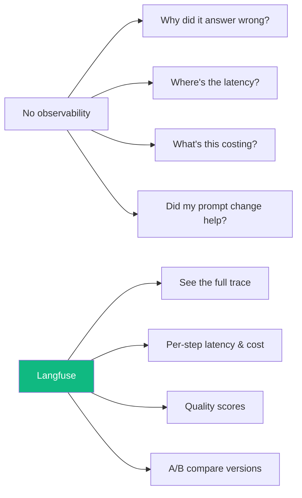
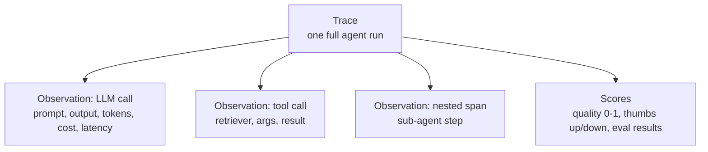
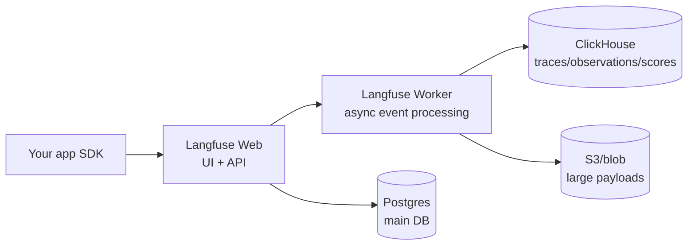
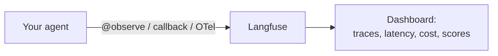
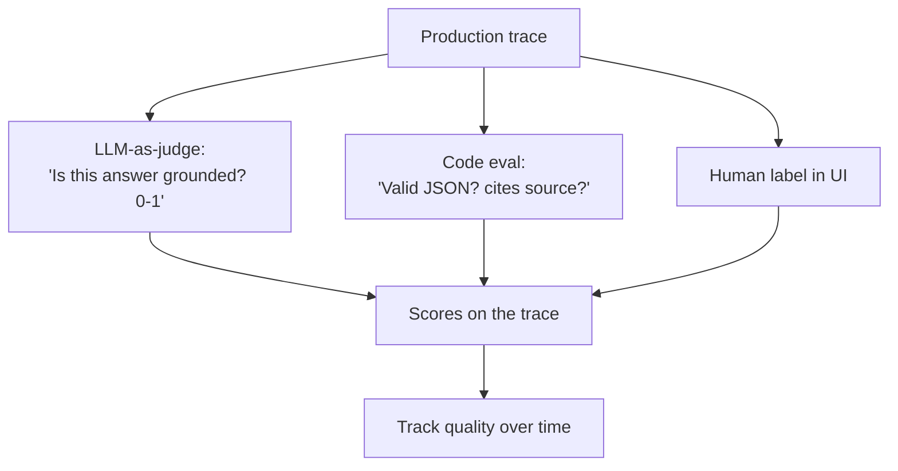
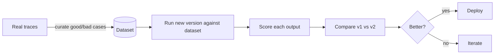

# Module 10 · Langfuse — Observability

🎯 **Goal:** Stop flying blind. Instrument your agents so you can see every LLM call, tool use, latency, cost, and quality score — then debug and improve based on real data. Observability is what separates a demo from a product.

> **Langfuse** is the leading open-source LLM engineering platform (YC W23). It does tracing, evals, prompt management, datasets, and a playground. It's the open alternative to LangSmith and integrates with OpenTelemetry, LangChain, LangGraph, and the OpenAI SDK.

---

## 🧠 Why observability is non-negotiable for AI

Normal software is deterministic — same input, same output. **LLM apps are probabilistic, multi-step, and fail silently** (a confident wrong answer looks identical to a right one). You cannot improve what you can't see.



---

## 🧠 The core data model — Traces, Observations, Scores



| Concept | Is | Example |
|---------|----|---------|
| **Trace** | The whole story of one request | "User asked X, agent did 5 steps, answered Y" |
| **Observation** | One step inside a trace | a single LLM call, a retrieval, a tool run |
| **Span / Generation** | Types of observation (work vs LLM call) | nested timing |
| **Score** | A quality measurement attached to a trace | LLM-judge gave 0.8, user 👍 |
| **Session** | Multiple traces from one conversation | a full chat thread |

---

## ⌨️ Setup (cloud or self-host)

**Fastest:** free Langfuse Cloud — sign up, create a project, copy your keys.

**Self-host** (you'll want this eventually — it's privacy-friendly and runs the same stack): Langfuse is **two app containers + two databases**:



```bash
# self-host in minutes
git clone https://github.com/langfuse/langfuse
cd langfuse && docker compose up
```

Set env vars in your app:
```bash
LANGFUSE_PUBLIC_KEY=pk-...
LANGFUSE_SECRET_KEY=sk-...
LANGFUSE_HOST=https://cloud.langfuse.com   # or your self-hosted URL
```

---

## ⌨️ Instrumenting — three ways

**1. Decorator (simplest):**
```python
from langfuse import observe

@observe()
def answer_question(q):
    # any LLM/tool calls inside are auto-traced
    ...
```

**2. LangChain/LangGraph callback (drop-in):**
```python
from langfuse.langchain import CallbackHandler
handler = CallbackHandler()
app.invoke({"messages": [("user", q)]}, config={"callbacks": [handler]})
# every node, LLM call, and tool in your LangGraph now shows up as a trace
```

**3. OpenTelemetry / SDK** for anything else. Because Langfuse speaks OTel, it works beyond LangChain too.



---

## 🧠 Evaluation — measuring quality

Tracing shows *what happened*; **evals** tell you if it was *good*. Langfuse supports several scoring methods:

| Method | How | Best for |
|--------|-----|----------|
| **LLM-as-a-judge** | Another LLM scores the output against criteria | Scale, fuzzy quality (helpfulness, correctness) |
| **Code/heuristic** | A function checks (regex, JSON valid, contains X) | Objective, cheap checks |
| **Human annotation** | You label traces in the UI | Ground truth, tricky cases |
| **User feedback** | 👍/👎 from real users → scores | Real-world signal |



⚠️ **Gotcha:** LLM-as-judge is useful but imperfect — calibrate it against human labels on a sample before trusting it at scale.

---

## 🧠 Datasets — the bridge to your harness (Module 11)

Langfuse **datasets** are saved sets of inputs (often pulled from real traces) with expected outputs. You run your app against the dataset and score the results — repeatable, regression-catching evaluation. This is exactly what powers the harness you build next.



**Prompt management bonus:** Langfuse can version your prompts, so you can change a prompt, run the dataset, and *prove* it improved before shipping — no more vibes-based prompt tweaking.

---

## 🛠️ Mini-project — instrument your LangGraph agent

1. Add the Langfuse callback to your Module 09 supervisor research graph.
2. Run 10 varied questions; open the dashboard and inspect traces — find the slowest step and the most expensive LLM call.
3. Add an **LLM-as-judge** score for "answer grounded in sources? 0–1."
4. Capture 5 good and 5 bad runs into a **dataset**.
5. Tweak one prompt, re-run against the dataset, and compare scores. Did it actually improve?

When you make a change and can *prove* with numbers that it helped, you've crossed from hobbyist to engineer.

---

## ✅ You've mastered this when…

- [ ] You can explain Trace → Observation → Score and Sessions
- [ ] Your agent's runs appear as traces with latency and cost
- [ ] You added at least one LLM-as-judge and one code eval
- [ ] You curated a dataset from real traces
- [ ] You compared two versions on a dataset and chose based on scores

**Next:** [11 · Build a Harness](11-Building-a-Harness.md) — turn evals into automated, repeatable testing for AI.
