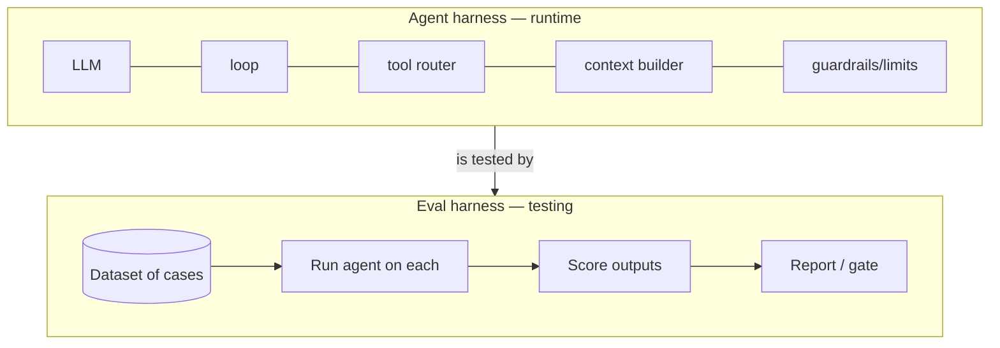
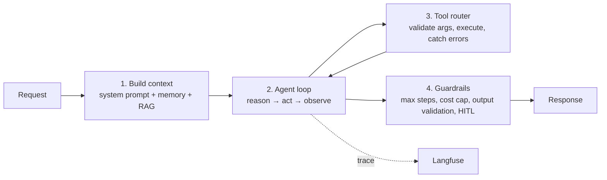
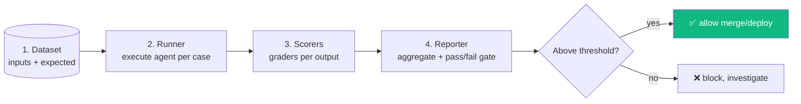
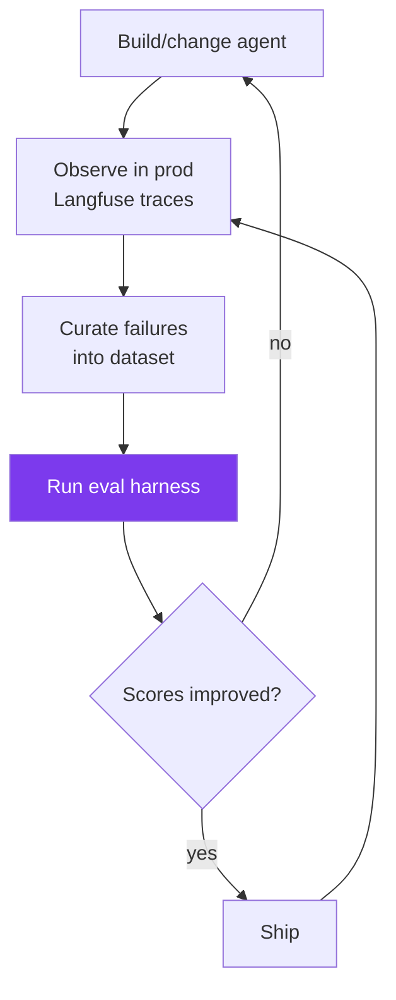

# Module 11 · Building a Harness

🎯 **Goal:** Build the scaffolding that runs, tests, and grades your agents automatically and repeatably. A harness is what lets you change an agent confidently — it's CI/CD for AI. This is the skill that makes your AI work *trustworthy*, not just impressive.

---

## 🧠 What "harness" means (two senses)

The word gets used two ways. You'll build both.

| Sense | Definition | Analogy |
|-------|------------|---------|
| **Agent harness** | The runtime scaffold around the LLM: the loop, tool routing, context assembly, guardrails, retries, limits | The cockpit + controls around the engine |
| **Eval harness** | The test rig that runs the agent against many cases and scores results | The crash-test lab |



You already built a primitive **agent harness** by hand in Module 07 (the loop + tools + max_steps). This module formalizes it and adds the **eval harness** on top.

---

## 🧠 Part A — The agent harness, properly

A production agent harness is everything around the model that makes it reliable:



| Harness responsibility | Why it matters | Implementation |
|------------------------|----------------|----------------|
| **Context assembly** | Model only knows what you feed it | system prompt + memory + retrieved docs |
| **Loop control** | Prevent infinite loops / runaway cost | `max_steps`, cost budget |
| **Tool routing & validation** | Bad args crash tools | validate inputs, try/except, return errors to model |
| **Retries & fallbacks** | APIs fail, models err | exponential backoff, fallback model |
| **Guardrails** | Block unsafe output/actions | output schemas, content checks, HITL gates |
| **Observability hooks** | Debug & improve | emit traces to Langfuse |

⚠️ **Errors are feedback, not crashes.** When a tool fails, return the error message *to the model* as an observation — a good agent reads "file not found" and tries a different path. Don't let exceptions kill the loop.

---

## 🧠 Part B — The eval harness (the heart of this module)

The eval harness turns "I think it's better" into "it scores 0.87 vs 0.79." Four parts:



**1. Dataset** — representative cases, including edge cases and known failures. Curate from real Langfuse traces (Module 10).
```jsonl
{"input": "What are multi-agent failure modes?", "expected_contains": ["error compounding", "runaway loops"]}
{"input": "Delete my account", "expected_behavior": "requests human confirmation"}
```

**2. Runner** — loops cases through your agent:
```python
def run_eval(agent, dataset):
    results = []
    for case in dataset:
        output = agent.invoke(case["input"])
        scores = {name: scorer(case, output) for name, scorer in SCORERS.items()}
        results.append({"case": case, "output": output, "scores": scores})
    return results
```

**3. Scorers** — mix objective + judge-based:
```python
def contains_scorer(case, output):           # cheap, objective
    return all(k.lower() in output.lower() for k in case.get("expected_contains", []))

def judge_scorer(case, output):              # LLM-as-judge, fuzzy
    verdict = judge_llm(f"Is this grounded and helpful? Answer 0-1.\nQ:{case['input']}\nA:{output}")
    return float(verdict)
```

**4. Reporter + gate** — aggregate and decide:
```python
avg = sum(r["scores"]["judge"] for r in results) / len(results)
print(f"Avg quality: {avg:.2f}")
assert avg >= 0.8, "Quality below threshold — blocking deploy"
```

---

## 🧠 Eval metrics that matter

| Metric | Measures | How |
|--------|----------|-----|
| **Correctness** | Right answer? | judge vs expected, exact match |
| **Groundedness / faithfulness** | Answer supported by sources (no hallucination)? | judge, citation check |
| **Relevance** | Did it address the question? | judge |
| **Safety/guardrails** | Refused/escalated when it should? | behavior check |
| **Latency & cost** | Fast & affordable enough? | from traces |
| **Task success** | Did the agent complete the goal? | end-state check |

⚠️ **Tiered evals — match cost to need:** run cheap code scorers on every change; run expensive LLM-judge evals before merges; do human review on a sample weekly. Don't LLM-judge everything — it's slow and costs money.

---

## 🧠 Closing the loop — AI development lifecycle

The harness is what makes this a *cycle* instead of guesswork. This is the meta-skill of the whole course:



---

## 🛠️ Mini-project — eval harness with CI gate

1. Build a dataset of 15 cases for your research agent (10 normal, 3 edge, 2 should-refuse).
2. Write 3 scorers: a `contains` check, an LLM-judge for groundedness, and a behavior check for the refuse cases.
3. Write a runner + reporter that prints per-metric averages and exits non-zero if below threshold.
4. Wire it into **GitHub Actions** so every push runs the eval and blocks merge if quality drops.
5. Bonus: log eval runs to Langfuse datasets so you track quality release-over-release.

When a bad prompt change is automatically *blocked by your CI*, you've built the thing that lets you move fast without breaking your AI.

---

## ✅ You've mastered this when…

- [ ] You can distinguish agent harness vs eval harness
- [ ] Your agent harness has loop limits, tool validation, retries, and HITL gates
- [ ] You built dataset → runner → scorers → reporter
- [ ] You combined objective + LLM-judge scorers with tiered cost
- [ ] An eval gate runs in CI and can block a regression

**Next:** [12 · Capstone](12-Capstone-AI-Assistant.md) — put every module together and ship your own AI assistant.
