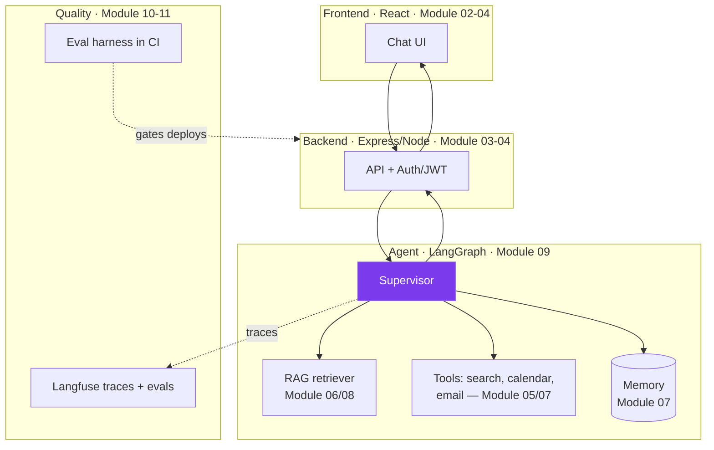
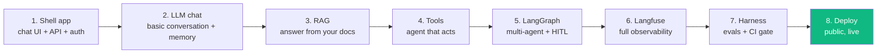
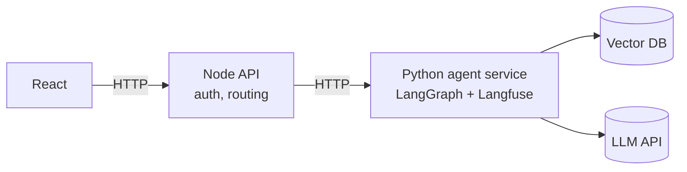
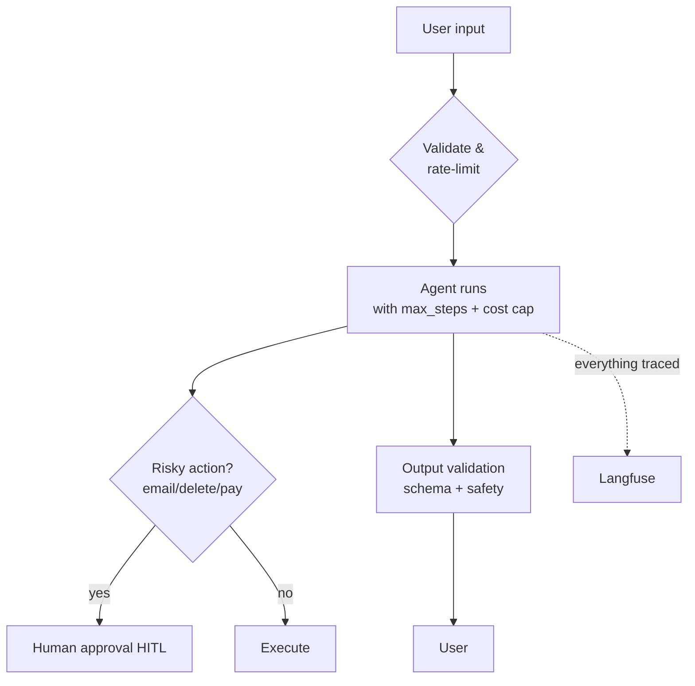
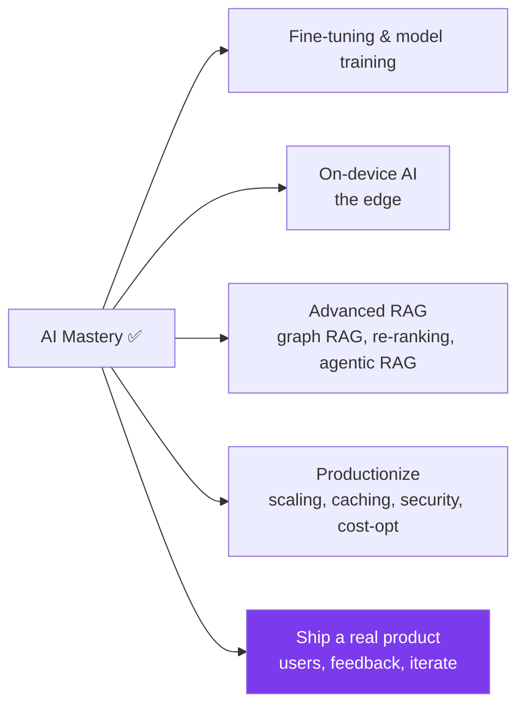

# Module 12 · Capstone — Build Your Own AI Assistant

🎯 **Goal:** Combine everything — web app, auth, automation, RAG, agents, LangGraph, Langfuse, and a harness — into one real, deployed, observable, evaluated AI assistant. It's a portfolio centerpiece and the seed of a real product.

---

## 🧠 What you're building

**"Athena"** — a personal AI assistant that answers from your knowledge base, uses tools to act, remembers you, and is fully observable and evaluated. Pick a domain that matters to you (a PM assistant, a customer-support agent, a research companion — your call). The architecture is the same.

**Every box maps to a module you've completed.** That's the point — the capstone proves the whole path.

---

## 🧠 Build order (each step is a checkpoint)

| Step | Modules used | Definition of done |
|------|-------------|--------------------|
| 1. Shell | 02, 03, 04 | Logged-in users can send/see messages |
| 2. Chat + memory | 06, 07 | Multi-turn conversation that remembers context |
| 3. RAG | 06, 08 | Answers grounded in your knowledge base, with sources |
| 4. Tools | 05, 07 | Agent uses ≥2 real tools (search, calendar, etc.) |
| 5. LangGraph | 09 | Supervisor + workers; HITL gate on risky actions |
| 6. Observability | 10 | Every run traced; cost/latency visible |
| 7. Harness | 11 | Eval dataset + CI gate blocks regressions |
| 8. Deploy | 04 | Live URL; a friend can use it |

---

## 🧠 Reference architecture decisions

| Decision | Sensible default | Why |
|----------|------------------|-----|
| Frontend | React (Vite) on Vercel | Module 04 |
| Backend | Express/Node OR FastAPI/Python | Python eases LangGraph/Langfuse |
| Agent framework | LangGraph | state, HITL, multi-agent |
| Vector store | Chroma (dev) → pgvector/Pinecone (prod) | RAG |
| LLM | Claude (sonnet for speed, opus for hard tasks) | quality/cost mix |
| Observability | Langfuse (self-host later) | open-source, full-featured |
| Memory | Short-term in state; long-term in vector DB | Module 07 |
| Auth | JWT + bcrypt | Module 04 |

⚠️ **Polyglot reality:** many real assistants run a **Python agent service** (LangGraph/Langfuse) behind a **Node/React app**. The React frontend calls the Node API, which calls the Python agent. That's normal — APIs are the glue (Module 05).

---

## 🧠 Guardrails & safety checklist (don't skip)

- Secrets server-side only (Module 03/04).
- Cost caps + `max_steps` so a loop can't bankrupt you.
- HITL on irreversible actions.
- Output validation before showing/acting.
- Eval gate before every deploy.

---

## 🛠️ The capstone deliverable

Ship and document:
1. **Live app** at a public URL with sign-up.
2. **GitHub repo** with clean structure, README, and architecture diagram.
3. **Langfuse dashboard** showing real traces.
4. **Eval harness** running in CI (green checkmark on PRs).
5. **A 2-minute demo video** + a short write-up of architecture decisions and trade-offs.

This is simultaneously a proof of mastery, a portfolio centerpiece, and a real product MVP. Use it.

---

## ✅ You've mastered the entire path when…

- [ ] A stranger can sign up and chat with your assistant at a live URL
- [ ] It answers from your knowledge base with sources (RAG)
- [ ] It uses ≥2 tools and asks permission before risky actions (HITL)
- [ ] It's built as a LangGraph multi-agent graph
- [ ] Every run is traced in Langfuse with cost/latency/quality
- [ ] An eval harness in CI blocks quality regressions
- [ ] You can explain every architectural choice and its trade-off

---

## 🚀 Where to go next (post-mastery)

You started by installing an editor. You now ship observable, evaluated, multi-agent AI. That's the whole arc — go build something real. 🏛️

**↩ Back to [the roadmap](../README.md) · Play the [coding sandbox game](../game/index.html) to lock it in.**
