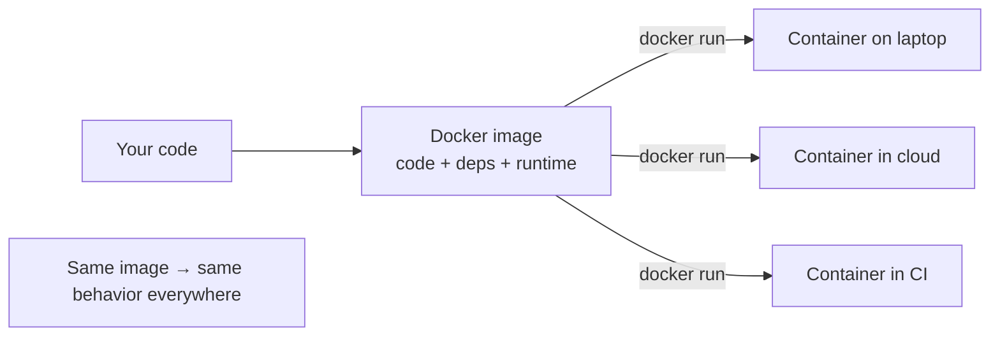
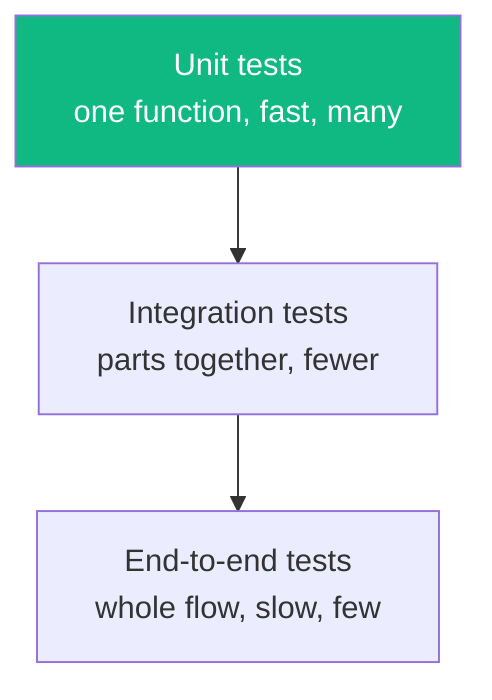
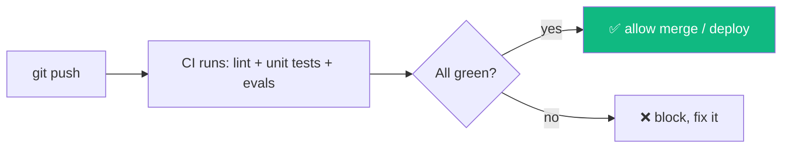
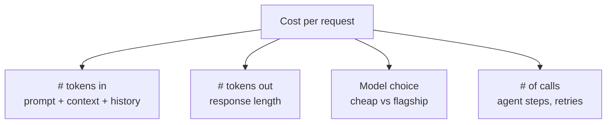
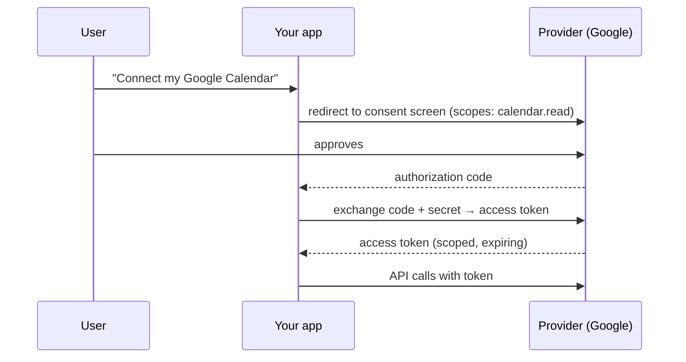
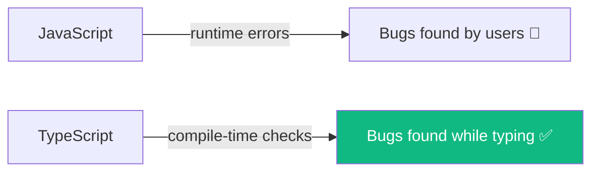

# Module 14 · Production Engineering

🎯 **Goal:** The unglamorous skills that separate "works on my laptop" from "runs reliably and affordably for real users": containers (Docker), automated testing + CI, LLM cost control, OAuth, and TypeScript. Each is a force-multiplier you'll use forever.

---

## 🧠 Part A — Docker (containers)

**The problem it solves:** "it works on my machine." A container packages your app *with* its exact environment (OS libs, Python/Node version, dependencies) so it runs identically everywhere — your laptop, a teammate's, the cloud.



| Term | Meaning | Analogy |
|------|---------|---------|
| **Image** | A frozen, shippable snapshot of your app + environment | A recipe + ingredients, vacuum-sealed |
| **Container** | A running instance of an image | The cooked meal |
| **Dockerfile** | The script that builds the image | The recipe steps |
| **Registry** | Where images are stored/shared (Docker Hub, GHCR) | The cookbook library |

**A real Dockerfile for your Python agent service:**
```dockerfile
FROM python:3.12-slim
WORKDIR /app
COPY requirements.txt .
RUN pip install --no-cache-dir -r requirements.txt
COPY . .
EXPOSE 8000
CMD ["uvicorn", "main:app", "--host", "0.0.0.0", "--port", "8000"]
```
```bash
docker build -t athena-agent .          # build the image
docker run -p 8000:8000 --env-file .env athena-agent   # run it
```

**docker-compose** runs multiple containers together — exactly your capstone stack:
```yaml
services:
  agent:   { build: ./agent, ports: ["8000:8000"], env_file: .env }
  api:     { build: ./api,   ports: ["4000:4000"], depends_on: [agent] }
  db:      { image: postgres:16, environment: { POSTGRES_PASSWORD: dev } }
```
```bash
docker compose up     # whole stack, one command (this is how you self-host Langfuse too)
```

⚠️ **Gotchas:** never `COPY` your `.env` into the image (pass env at runtime); use `.dockerignore` (like `.gitignore`) to keep `node_modules`/secrets out; use `slim` base images to stay small.

---

## 🧠 Part B — Testing & CI (for normal code)

You met *evals* (testing AI) in Module 11. This is testing *deterministic* code — the foundation evals build on. The test pyramid:



**Unit test (Python, pytest):**
```python
# math_utils.py
def add(a, b): return a + b

# test_math_utils.py
from math_utils import add
def test_add():
    assert add(2, 3) == 5
    assert add(-1, 1) == 0
```
```bash
pytest                    # runs everything named test_*
```

**Unit test (JS, Jest/Vitest):**
```javascript
import { add } from "./math.js";
test("adds numbers", () => {
  expect(add(2, 3)).toBe(5);
});
```

**CI (Continuous Integration)** runs your tests automatically on every push, so broken code never reaches `main`. GitHub Actions:
```yaml
# .github/workflows/ci.yml
name: CI
on: [push, pull_request]
jobs:
  test:
    runs-on: ubuntu-latest
    steps:
      - uses: actions/checkout@v4
      - uses: actions/setup-python@v5
        with: { python-version: "3.12" }
      - run: pip install -r requirements.txt
      - run: pytest            # ← and your eval harness from Module 11
```



⚠️ **The habit:** write the test when you write the code, not "later." For AI apps, your CI runs *both* unit tests (code) and the eval harness (quality + security).

---

## 🧠 Part C — LLM cost & token economics

At any real scale, "it works" isn't enough — someone will ask "what does this cost per 1,000 users?" You bill per **token** (input + output), so cost is an engineering variable you control.



**The levers, highest-impact first:**

| Lever | How | Savings |
|-------|-----|---------|
| **Right-size the model** | Cheap/small model for easy steps; flagship only for hard reasoning (model routing) | Often 5–20× |
| **Prompt caching** | Cache the static system prompt / long context so you don't re-pay for it each call | Big for long contexts |
| **Trim context** | Summarize old history; retrieve only top-k chunks; don't dump whole docs | Linear with tokens |
| **Cap output** | Set `max_tokens`; ask for concise answers | Output tokens cost more |
| **Limit steps** | `max_steps`, avoid needless tool loops | Caps worst case |
| **Batch / async** | Batch embeddings; parallelize independent calls | Throughput |

```python
# model routing: cheap first, escalate only if needed
def answer(question, hard=False):
    model = "claude-opus-4-8" if hard else "claude-haiku-4-5-20251001"
    return client.messages.create(model=model, max_tokens=400, messages=[...])
```

⚠️ **Always instrument cost** (Langfuse, Module 10) *before* optimizing — measure, don't guess. The biggest real-world cost sink is usually bloated context and over-using the flagship model for trivial steps.

---

## 🧠 Part D — OAuth (delegated access)

When your app acts on a user's behalf in *their* Google/GitHub/Slack account, you don't ask for their password — you use **OAuth**: they grant your app a scoped, revocable token.



| Term | Meaning |
|------|---------|
| **Scopes** | Exactly what you're allowed to do (`read calendar`, not "everything") |
| **Access token** | Short-lived key to call the API |
| **Refresh token** | Used to get new access tokens without re-asking |
| **Consent screen** | Where the user approves |

⚠️ **Least privilege again:** request the *minimum* scopes. Store tokens encrypted, server-side. This is how your assistant will safely touch Gmail, Calendar, Notion, etc.

---

## 🧠 Part E — TypeScript (typed JavaScript)

TypeScript adds **types** to JavaScript, catching whole classes of bugs *before* you run the code. It's increasingly the default for serious Node/React (and there are TS SDKs for LangChain, LangGraph, and the LLM providers).

```typescript
// JS: silent bug — passes a string where a number is expected
function price(qty, unit) { return qty * unit; }
price("3", 10);              // "3" * 10 ... surprises

// TS: caught at edit time
function price(qty: number, unit: number): number { return qty * unit; }
price("3", 10);             // ❌ Type error before it ever runs

interface Note { id: string; title: string; done: boolean; }
const n: Note = { id: "1", title: "Learn TS", done: false };  // shape enforced
```



**When to adopt:** once a JS project grows past a few files or has a team. For learning, ship a couple of projects in plain JS first (you did), then convert one to TS to feel the difference. Not mandatory for Python-side AI work, but valuable for the web layer.

---

## 🛠️ Mini-project — productionize the capstone scaffold

1. Write a `Dockerfile` for your agent service and a `docker-compose.yml` for agent + api + db; bring it all up with `docker compose up`.
2. Add unit tests for your non-AI utilities (pytest or Vitest) and a GitHub Actions workflow that runs tests + your eval harness on every push.
3. Add Langfuse cost tracking, then implement model routing (cheap model for simple turns) and measure the savings.
4. Add OAuth for one provider (Google Calendar) with read-only scope.
5. Convert your React frontend to TypeScript and fix the type errors it surfaces.

---

## ✅ You've mastered this when…

- [ ] You can containerize an app and run a multi-service stack with docker compose
- [ ] You write unit tests and a CI workflow that gates merges on tests + evals
- [ ] You can list the top cost levers and implement model routing
- [ ] You can explain OAuth scopes/tokens and why not to use passwords
- [ ] You converted a project to TypeScript and saw it catch a real bug

**Next:** [15 · Advanced RAG & MCP](15-Advanced-RAG-and-MCP.md) — better retrieval, and building your own MCP tool servers.
