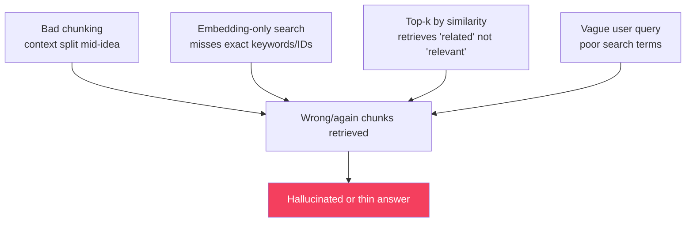
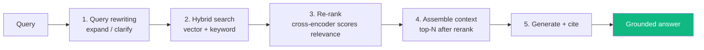
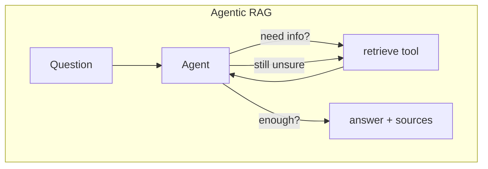
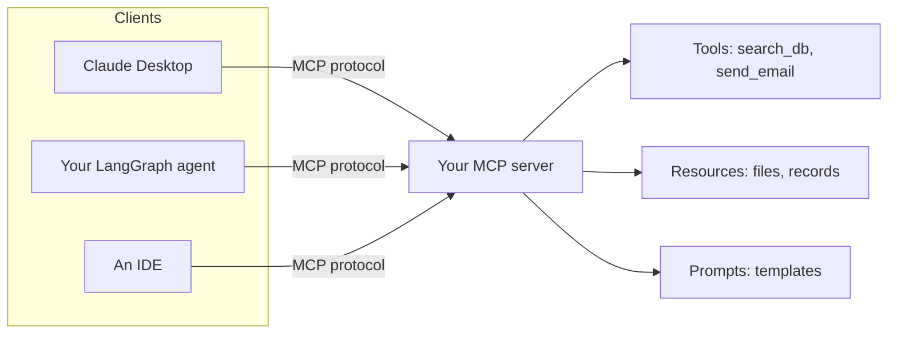
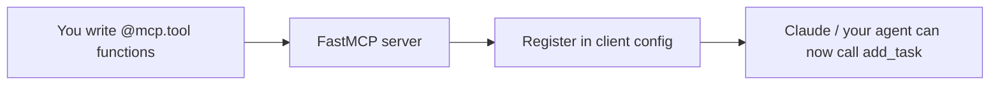

# Module 15 · Advanced RAG & Building MCP Servers

🎯 **Goal:** Push past basic RAG into the techniques that actually make retrieval reliable (chunking, hybrid search, re-ranking, query rewriting, agentic RAG), then build your own **MCP server** so any agent — including Claude — can use tools you wrote.

> This module is the *builder's* take on MCP and retrieval: make retrieval good, and ship a tool server.

---

## 🧠 Why basic RAG underperforms

Module 06 RAG = embed chunks, grab top-k, stuff into prompt. It works in demos and disappoints in production because **retrieval quality caps answer quality.** The usual failures:



---

## 🧠 The advanced RAG pipeline

Each stage fixes one failure above.



| Technique | Problem it fixes | Gist |
|-----------|------------------|------|
| **Smart chunking** | Split mid-idea | Chunk on structure (headings/paragraphs); add overlap; keep ~300–800 tokens; attach metadata (source, section) |
| **Hybrid search** | Pure vectors miss exact terms (names, IDs, error codes) | Combine semantic (vector) + lexical (BM25/keyword), merge scores |
| **Re-ranking** | "Similar" ≠ "answers the question" | A cross-encoder re-scores the top ~50 candidates; keep the best ~5 |
| **Query rewriting / HyDE** | Short/ambiguous queries retrieve poorly | LLM rewrites/expands the query, or generates a hypothetical answer to embed |
| **Metadata filtering** | Searching the whole corpus | Pre-filter by source/date/user before vector search |
| **Agentic RAG** | One-shot retrieval isn't enough | The agent *decides* when/what to retrieve, can search multiple times, and verifies |



⚠️ **Don't add all of this at once.** Start basic, measure with your eval harness (Module 11), then add the one technique that fixes your observed failure. Re-ranking is usually the highest ROI single upgrade.

---

## ⌨️ Hybrid search + rerank (sketch)

```python
# 1. retrieve candidates two ways
vec_hits   = vector_store.search(query, k=25)          # semantic
kw_hits    = bm25_index.search(query, k=25)            # lexical/keyword
candidates = dedupe(vec_hits + kw_hits)

# 2. re-rank with a cross-encoder (scores each (query, chunk) pair)
from sentence_transformers import CrossEncoder
reranker = CrossEncoder("cross-encoder/ms-marco-MiniLM-L-6-v2")
scored = sorted(candidates, key=lambda c: reranker.predict([(query, c.text)]), reverse=True)

top = scored[:5]                                       # tight, relevant context
```

---

## 🧠 MCP — the standard way to give agents tools

**Model Context Protocol** is an open standard (think "USB-C for AI tools"): instead of hard-wiring tools into one app, you run an **MCP server** that exposes tools/data, and *any* MCP-compatible client (Claude Desktop, your agent, IDEs) can use it.



**The 3 primitives an MCP server exposes:**

| Primitive | Is | Example |
|-----------|----|---------|
| **Tools** | Actions the model can invoke | `create_ticket(title, body)` |
| **Resources** | Readable data/context | a file, a DB row, an API result |
| **Prompts** | Reusable prompt templates | "/summarize-thread" |

---

## ⌨️ Build a minimal MCP server (Python)

```python
# pip install "mcp[cli]"
from mcp.server.fastmcp import FastMCP

mcp = FastMCP("taskvault")

@mcp.tool()
def add_task(title: str) -> str:
    """Add a task to TaskVault and return its id."""
    # ...write to your DB...
    return "task-123 created"

@mcp.resource("tasks://open")
def open_tasks() -> str:
    """All currently open tasks."""
    return "1. Learn MCP\n2. Ship capstone"

if __name__ == "__main__":
    mcp.run()      # speaks MCP over stdio; register it in Claude Desktop or your agent
```

The docstrings and type hints *are* the interface the model reads — same lesson as `@tool` in LangChain (Module 08), now portable across every client.



⚠️ **Security carries over from Module 13:** an MCP server is real capability. Validate inputs, scope what it can touch, and gate destructive tools — a malicious prompt reaching an over-powered MCP server is exactly the "excessive agency" risk.

---

## 🛠️ Mini-project — upgrade retrieval + ship a tool server

**Part 1 — better RAG:** take your Module 06/08 RAG app and add (a) metadata-aware chunking and (b) a re-ranking step. Measure before/after on your eval dataset — prove the lift in groundedness scores.

**Part 2 — your MCP server:** build an MCP server exposing 2 tools over your TaskVault data (`add_task`, `list_tasks`) and one resource. Register it in Claude Desktop (or call it from your agent) and use your own tool from a chat.

When Claude can call a tool *you* wrote, and your RAG measurably improved, you've crossed into building reusable AI infrastructure.

---

## ✅ You've mastered this when…

- [ ] You can name 4 RAG failure modes and the technique that fixes each
- [ ] You added re-ranking and proved a quality lift on your eval set
- [ ] You can explain hybrid search and agentic RAG
- [ ] You built and registered an MCP server exposing a tool you wrote
- [ ] You applied least-privilege/validation to that server

**Next:** This completes **Track A**. If you want to learn how the models themselves are *built and fine-tuned*, start **Track B** → [B1 · Math & ML Foundations](B1-Math-and-ML-Foundations.md).
