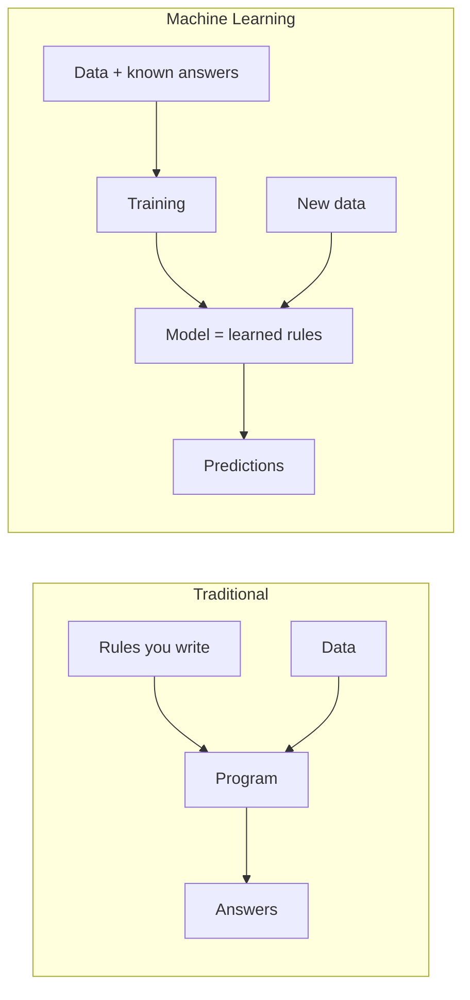
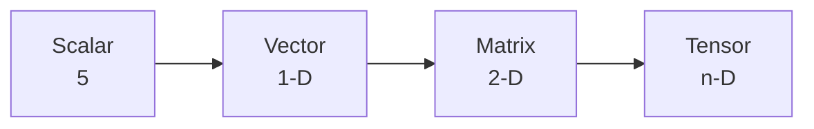
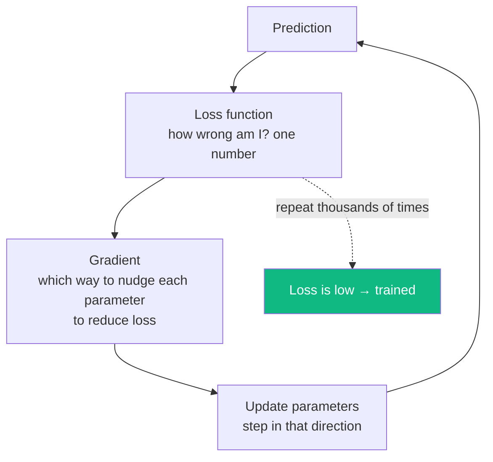
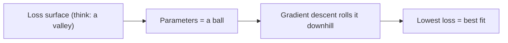
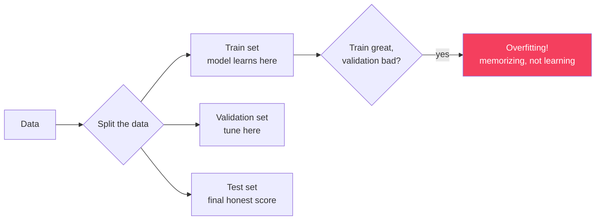
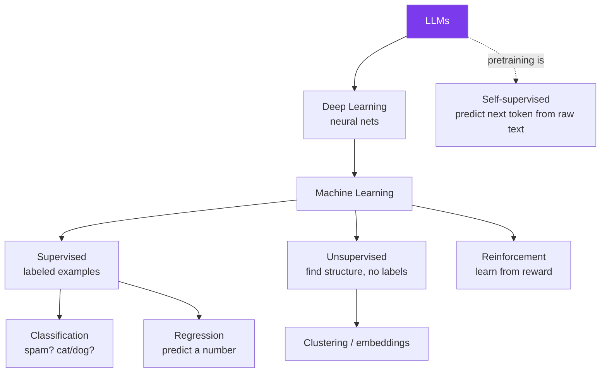

# Module B1 · Math & ML Foundations

🎯 **Goal:** Build the minimum, *correct* mental model of how machines learn — vectors, the loss function, and gradient descent — so the rest of Track B (neural nets, transformers, fine-tuning) rests on understanding, not memorization. No PhD math; just the load-bearing ideas, with intuition first.

> **Track B is a different discipline from Track A.** Track A = *use* models. Track B = *build and adapt* models. You don't need Track B to build great AI products — but if you want to understand how the models themselves work, this is where the "magic" becomes mechanics.

---

## 🧠 The one idea behind all of machine learning

Traditional programming: *you* write the rules. Machine learning: you show **examples**, and the machine *finds* the rules (a function) that fit them.



**"Learning" = adjusting numbers (parameters) until the model's predictions match the known answers.** That's the whole game. Everything else is detail about *how* you adjust them and *what shape* the function has.

---

## 🧠 Vectors, matrices, tensors — the data of ML

Everything — a word, an image, an audio clip — becomes **numbers in arrays**. You met embeddings (text → vector) in Module 06; here's the vocabulary.

| Object | Is | Shape example | In AI |
|--------|----|--------------:|-------|
| **Scalar** | one number | `5` | a single value |
| **Vector** | a list of numbers | `[0.2, -0.4, 0.9]` | one embedding |
| **Matrix** | a grid (rows × cols) | `3×4` | a batch of vectors; a weight layer |
| **Tensor** | n-dimensional array | `32×128×768` | a batch of sequences of embeddings |



**The one operation that dominates:** the **dot product** (and its big sibling, matrix multiplication). You already wrote it in the game. It measures alignment between vectors — and a neural network is, at its core, *matrix multiplications stacked with simple nonlinear functions.*

```python
import numpy as np
a = np.array([1, 2, 3])
b = np.array([4, 5, 6])
print(np.dot(a, b))          # 32  → one number summarizing alignment
W = np.random.rand(4, 3)     # a weight matrix (a "layer")
print(W @ a)                 # matrix × vector = the layer's output (4 numbers)
```

⚠️ **Why GPUs/NPUs matter:** these matrix multiplications are massively parallel. GPUs and NPUs exist to do billions of them per second. "AI compute" basically means "matrix-multiply throughput."

---

## 🧠 The learning loop — loss and gradient descent

How does a model "adjust numbers until predictions match"? Three pieces:



1. **Loss function** — measures how wrong the model is on the examples, as a single number. Lower = better. (e.g. mean-squared error for numbers, cross-entropy for "which token/class".)
2. **Gradient** — the calculus part, but the intuition is simple: it tells you, for each parameter, *which direction and how much* to change it to make the loss smaller. (It's the slope of the loss surface.)
3. **Gradient descent** — take a small step downhill, repeat. The **learning rate** is the step size.



⚠️ **Learning rate is the key knob.** Too big → it overshoots and never settles; too small → it learns painfully slowly. You'll tune this constantly when fine-tuning (B4).

---

## 🧠 Overfitting — the central danger

A model can "memorize" the training examples instead of *learning the pattern* — then it fails on anything new. This is **overfitting**, and managing it is most of practical ML.



| Symptom | Diagnosis | Fixes |
|---------|-----------|-------|
| Great on train, bad on new data | **Overfitting** | More data, regularization, simpler model, early stopping, dropout |
| Bad on train *and* new data | **Underfitting** | Bigger model, train longer, better features |

**The cardinal rule: never evaluate on data you trained on.** Always hold out a test set. (This is the same instinct as your eval datasets in Module 11 — now you see its statistical root.)

---

## 🧠 The ML landscape (where LLMs sit)



**Key placement:** LLMs are deep neural networks trained **self-supervised** (the "label" is just the next word in ordinary text — no human labeling needed), then refined with supervised + reinforcement methods (B4).

---

## 🛠️ Mini-project — learn gradient descent by hand

Fit a line `y = w·x + b` to data using gradient descent from scratch (no ML library) — this is the entire learning loop in 20 lines, and it's exactly what scales up to LLMs.

```python
import numpy as np
# fake data: y ≈ 2x + 1
X = np.array([1,2,3,4,5], dtype=float)
y = 2*X + 1 + np.random.randn(5)*0.1

w, b, lr = 0.0, 0.0, 0.01
for step in range(1000):
    pred = w*X + b
    loss = ((pred - y)**2).mean()             # 1. loss
    dw = (2*(pred - y)*X).mean()              # 2. gradients
    db = (2*(pred - y)).mean()
    w -= lr*dw; b -= lr*db                     # 3. update (descend)
    if step % 200 == 0: print(f"step {step}: loss={loss:.3f} w={w:.2f} b={b:.2f}")
print(f"Learned: y = {w:.2f}x + {b:.2f}   (true: y = 2x + 1)")
```
Watch `w` climb toward 2 and `b` toward 1 as loss falls. **You just trained a model.** B2 stacks this idea into neural networks.

---

## ✅ You've mastered this when…

- [ ] You can explain "learning = adjust parameters to lower a loss" in one sentence
- [ ] You know scalar/vector/matrix/tensor and why matrix-multiply is everything
- [ ] You can describe loss → gradient → update and what the learning rate does
- [ ] You can explain overfitting and why you hold out a test set
- [ ] Your from-scratch gradient descent recovered `y = 2x + 1`

**Next:** [B2 · Neural Networks & PyTorch](B2-Neural-Networks-and-PyTorch.md) — stack this into real networks.
