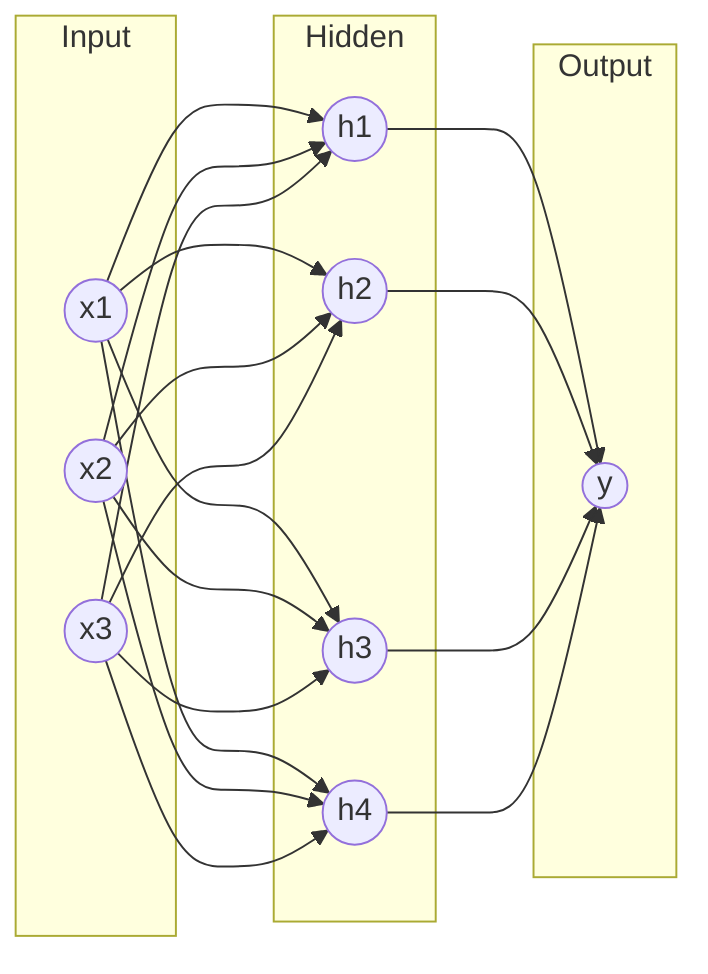
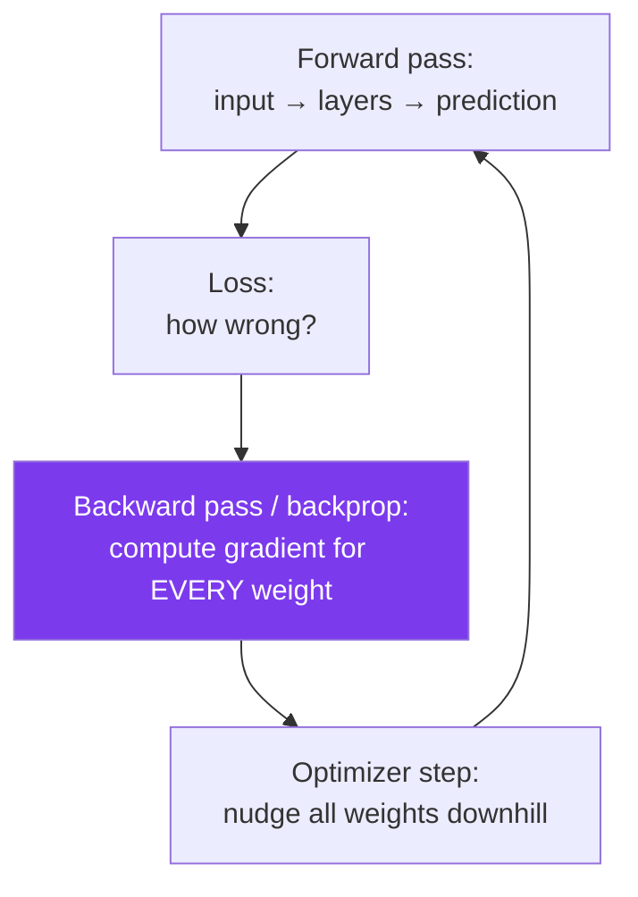
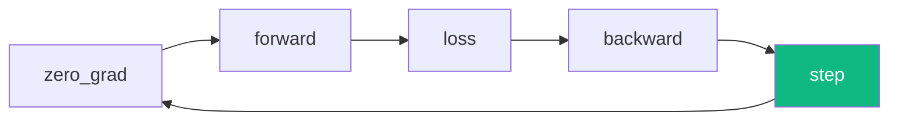
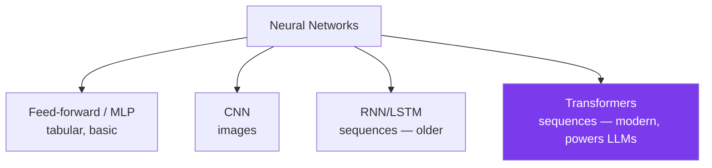

# Module B2 · Neural Networks & PyTorch

🎯 **Goal:** Understand what a neural network actually is, then build and train one in **PyTorch** — the framework nearly all modern AI (including LLMs) is built in. By the end you'll have trained a real network on real data.

---

## 🧠 What a neural network is

Take B1's "stack matrix-multiplies with a simple nonlinear function" and picture it as layers of **neurons**. Each neuron: multiply inputs by weights, add a bias, pass through an **activation function**. Stack layers → the network can represent very complex functions.



| Part | Role |
|------|------|
| **Weights** | The learnable numbers (what gradient descent tunes) |
| **Bias** | A learnable offset per neuron |
| **Activation** (ReLU, GELU, sigmoid) | The nonlinearity — without it, stacked layers collapse to one linear function |
| **Layer** | A matrix multiply + bias + activation |
| **Depth** | More layers = "deep" learning = more expressive |

⚠️ **Why the activation matters:** matrix-multiplies alone, stacked, are still just one matrix-multiply (linear). The nonlinear activation is what lets networks learn curves, edges, grammar — anything non-trivial.

---

## 🧠 Forward pass, backward pass (backpropagation)

Training a network is B1's loop, scaled:



- **Forward pass:** data flows through the layers to a prediction.
- **Backpropagation:** the chain rule efficiently computes how each of the (sometimes billions of) weights contributed to the error.
- **Optimizer** (SGD, **Adam**): applies the update using those gradients.

**The good news:** PyTorch computes backprop *for you* automatically (autograd). You define the forward pass; it figures out the gradients.

---

## ⌨️ PyTorch — the essentials

```bash
pip install torch
```

**Tensors** = NumPy arrays that (a) run on GPU and (b) track gradients.
```python
import torch
x = torch.tensor([1., 2., 3.])
w = torch.tensor([0.5], requires_grad=True)   # track gradients for this
loss = ((w * x).sum() - 10) ** 2
loss.backward()                               # autograd computes the gradient
print(w.grad)                                 # PyTorch did the calculus
```


---

## ⌨️ Build & train a real network

A classic: classify handwritten digits (MNIST). This is the "hello world" of deep learning and contains every concept you'll use in LLM training.

```python
import torch, torch.nn as nn
from torch.utils.data import DataLoader
from torchvision import datasets, transforms

# 1. Data
train = datasets.MNIST("./data", train=True, download=True, transform=transforms.ToTensor())
loader = DataLoader(train, batch_size=64, shuffle=True)

# 2. Model (a simple feed-forward net)
class Net(nn.Module):
    def __init__(self):
        super().__init__()
        self.net = nn.Sequential(
            nn.Flatten(),
            nn.Linear(28*28, 128), nn.ReLU(),     # layer + activation
            nn.Linear(128, 10),                   # 10 digit classes
        )
    def forward(self, x): return self.net(x)

model = Net()
loss_fn = nn.CrossEntropyLoss()                   # for classification
optimizer = torch.optim.Adam(model.parameters(), lr=1e-3)

# 3. The training loop (this is B1's loop, batched)
for epoch in range(3):
    for images, labels in loader:
        optimizer.zero_grad()                     # reset gradients
        preds = model(images)                     # forward pass
        loss = loss_fn(preds, labels)             # how wrong
        loss.backward()                           # backprop
        optimizer.step()                          # update weights
    print(f"epoch {epoch}: loss {loss.item():.3f}")
```

**Read the loop carefully** — `zero_grad → forward → loss → backward → step` is the heartbeat of *all* neural network training, from this 100KB net to a 100-billion-parameter LLM. The scale changes; the loop doesn't.



---

## 🧠 Key knobs (hyperparameters)

These are the dials you'll turn — and the same ones you'll set when fine-tuning LLMs (B4).

| Knob | What it does | Typical |
|------|--------------|---------|
| **Learning rate** | Step size of updates | 1e-3 to 1e-5 |
| **Batch size** | Examples per update | 16–256 (limited by memory) |
| **Epochs** | Passes over the dataset | a few to many |
| **Optimizer** | How updates are applied | Adam/AdamW (default) |
| **Architecture** | Layers, width, activation | task-dependent |

⚠️ **Hardware reality:** training is memory-hungry. The model's weights, gradients, *and* optimizer state all sit in memory at once — roughly several times the model size. This is *why* fine-tuning huge LLMs needs the tricks in B4 (LoRA/quantization), and why GPUs/NPUs exist.

---

## 🧠 Types of networks (the family tree)



You'll meet **Transformers** next — they're the architecture behind every LLM, and they replaced RNNs because they handle long sequences in parallel.

---

## 🛠️ Mini-project — train and evaluate MNIST

1. Run the training loop above.
2. **Hold out a test set** (`datasets.MNIST(train=False)`) and compute accuracy on it — never on training data (B1's rule).
3. Deliberately overfit: train 30 epochs on a tiny subset and watch test accuracy *drop* while train accuracy hits ~100%. Feel overfitting in your hands.
4. Fix it: add `nn.Dropout(0.2)` and more data; watch test accuracy recover.

When you can train a net, measure honest test accuracy, *cause* overfitting, and *cure* it, you understand deep learning's core loop.

---

## ✅ You've mastered this when…

- [ ] You can explain weights, bias, activation, and why nonlinearity is essential
- [ ] You can describe forward pass → loss → backprop → optimizer step
- [ ] You trained a PyTorch network and the loss went down
- [ ] You measured test accuracy and caused/cured overfitting
- [ ] You can name the network families and where Transformers fit

**Next:** [B3 · How LLMs Are Built](B3-How-LLMs-Are-Built.md) — from neurons to GPT.
