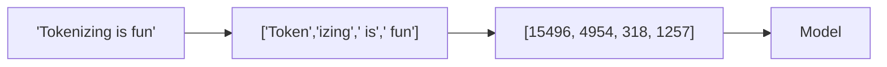
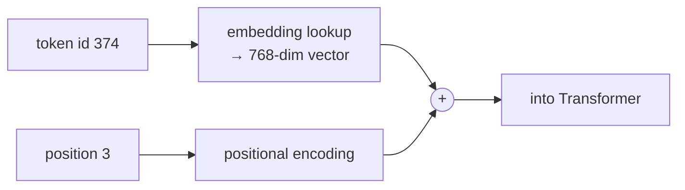
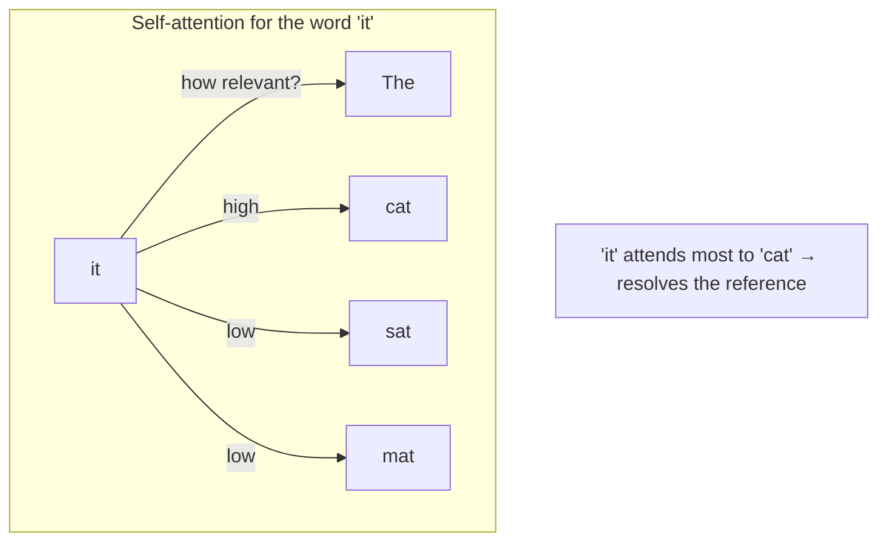
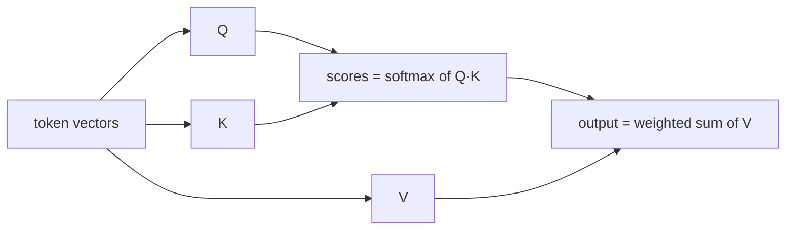
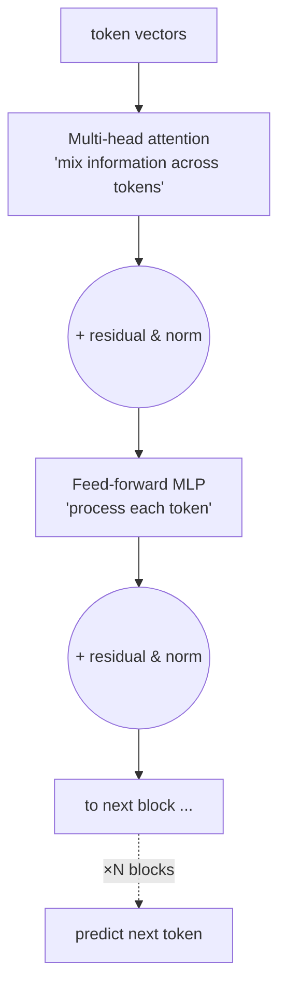
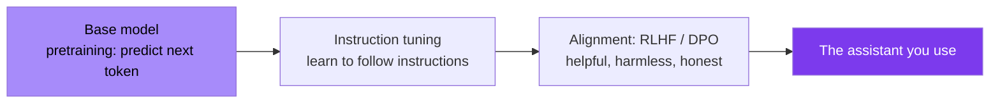

# Module B3 · How LLMs Are Built

🎯 **Goal:** Connect neurons (B2) to GPT. Understand tokenization, the Transformer/attention mechanism, and the pretraining process that turns raw internet text into a model that can write code and reason. This is the builder's narrative — from neurons to GPT.

---

## 🧠 The journey from text to a trained LLM

```mermaid
flowchart LR
    Text[Raw text<br/>trillions of words] --> Tok[1. Tokenize<br/>text → token IDs]
    Tok --> Emb[2. Embed<br/>IDs → vectors]
    Emb --> TF[3. Transformer layers<br/>attention + feed-forward]
    TF --> Pred[4. Predict next token]
    Pred --> Loss[5. Loss vs actual next token]
    Loss --> Upd[6. Backprop + update<br/>B2's loop, at scale]
    Upd -.billions of times.-> LLM[Pretrained base model]
    style LLM fill:#7c3aed,color:#fff
```



It's B2's training loop — just with the Transformer architecture, an enormous dataset, and the self-supervised task "predict the next token."

---

## 🧠 Step 1 — Tokenization

Models don't see characters or words; they see **tokens** (sub-word chunks). A tokenizer (e.g. BPE — byte-pair encoding) splits text into a fixed vocabulary of ~50k–200k tokens.



```python
# pip install tiktoken
import tiktoken
enc = tiktoken.get_encoding("cl100k_base")
ids = enc.encode("Tokenizing is fun")
print(ids)                       # e.g. [3404, 4954, 374, 2523]
print([enc.decode([i]) for i in ids])   # see the pieces
```

⚠️ **Why you care:** tokens are the unit of context windows and billing (Module 06/14). "Why did it miscount letters in a word?" — because it sees tokens, not letters. Rare words split into many tokens; common ones are single tokens.

---

## 🧠 Step 2 — Embeddings + position

Each token ID maps to a learned **embedding vector** (B1). Because the Transformer processes all tokens in parallel (not left-to-right), it also adds **positional information** so the model knows word order.



---

## 🧠 Step 3 — Attention, the core idea

The breakthrough ("Attention Is All You Need," 2017). **Attention lets every token look at every other token and decide which ones matter for predicting what comes next.** That's how the model resolves "it" → which noun, or tracks a topic across a paragraph.



**The mechanism (Q, K, V) in plain terms:** each token emits a **Query** ("what am I looking for?"), a **Key** ("what do I offer?"), and a **Value** ("what I'll contribute"). A token's new representation = a weighted blend of all tokens' Values, weighted by how well its Query matches their Keys.

| Term | Plain meaning |
|------|---------------|
| **Query (Q)** | What this token is looking for |
| **Key (K)** | What each token advertises |
| **Value (V)** | The information each token passes along |
| **Attention score** | Q·K similarity → softmax → weights |
| **Multi-head** | Several attentions in parallel, each catching a different relationship |



---

## 🧠 Step 4 — The Transformer block, stacked

A Transformer **block** = multi-head attention + a feed-forward network (the MLP from B2), with residual connections and normalization for stable training. Stack dozens to hundreds of these blocks → a large language model.



| Component | Job |
|-----------|-----|
| Attention | Move information *between* tokens |
| Feed-forward | Transform *each* token's representation |
| Residual + norm | Keep gradients stable across many layers |
| Final layer | Project to vocabulary → probability for each next token |

**Model size** ≈ number of these weights ("parameters"): 7B, 70B, 400B+. More parameters + more data + more compute → more capability (the "scaling laws").

---

## 🧠 Step 5 — Pretraining, then the rest

**Pretraining** is the expensive part: predict the next token over trillions of tokens of internet text, for weeks, on thousands of GPUs. The result is a **base model** — knowledgeable but raw (it just continues text; it doesn't "follow instructions" yet).



| Stage | What it does | Cost |
|-------|--------------|------|
| **Pretraining** | Learns language, facts, reasoning from raw text (self-supervised) | $$$ millions, huge compute |
| **Instruction tuning (SFT)** | Learns to follow instructions from example Q→A pairs | $ moderate |
| **Alignment (RLHF/DPO)** | Tuned toward helpful/harmless/honest using preference data | $ moderate |

**You won't pretrain** (that's frontier-lab scale). But **you can do the last two stages on a base model — that's fine-tuning (B4)**, and it's very achievable.

---

## 🛠️ Mini-project — see the machine think

1. **Tokenizer explorer:** with `tiktoken`, tokenize a sentence, a rare word ("antidisestablishmentarianism"), an emoji, and code. Note how token counts vary — internalize why letter-counting is hard for LLMs.
2. **Tiny GPT (optional, high-value):** follow Andrej Karpathy's "Let's build GPT" / nanoGPT and train a *character-level* Transformer on a small text file (e.g. Shakespeare). It's small enough to train on a laptop/Colab and makes attention concrete. You'll watch it go from gibberish to Shakespeare-ish.
3. Write 5 sentences in your own words explaining attention to a smart 15-year-old. If you can, you understand it.

---

## ✅ You've mastered this when…

- [ ] You can explain tokenization and why it affects context limits and billing
- [ ] You can explain attention via Q/K/V in plain language
- [ ] You can describe a Transformer block (attention + FFN + residual)
- [ ] You can distinguish pretraining vs instruction tuning vs alignment
- [ ] You know which stages *you* can realistically do (the last two)

**Next:** [B4 · Fine-Tuning LLMs](B4-Fine-Tuning-LLMs.md) — adapt a base model to *your* task.
