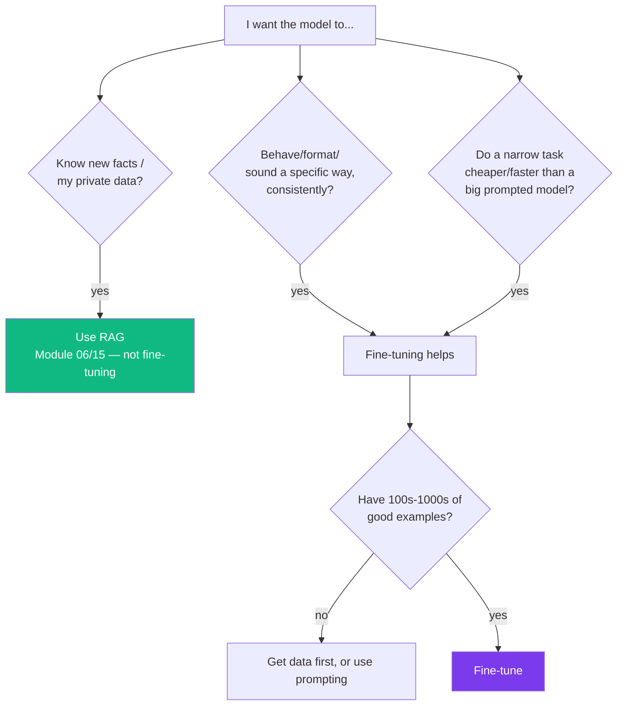
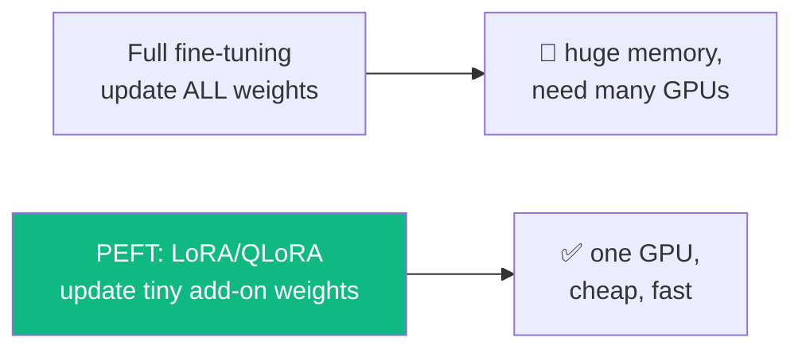
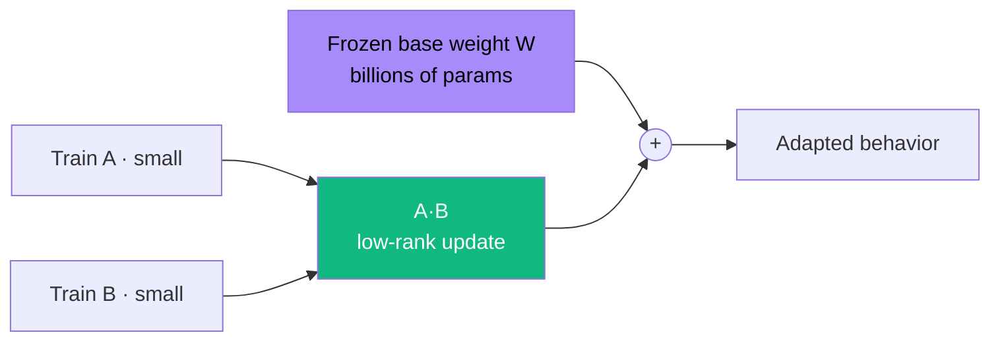
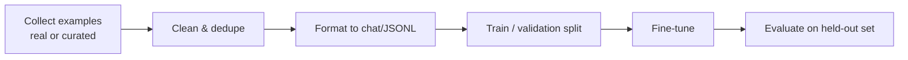
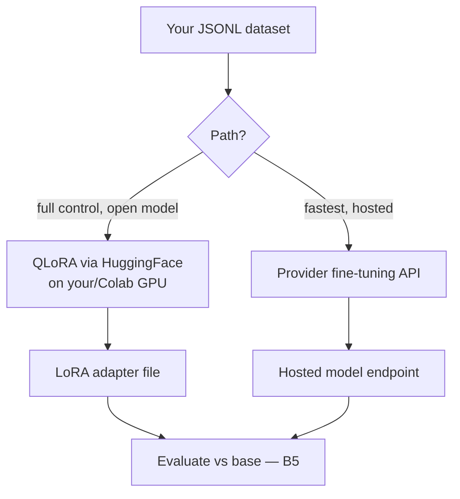

# Module B4 · Fine-Tuning LLMs

🎯 **Goal:** Take a pretrained base/instruct model and adapt it to *your* task, style, or domain — affordably, on accessible hardware — using LoRA/QLoRA. You'll learn when fine-tuning beats RAG, how to build a dataset, and how to actually run a fine-tune.

> This is the most practical, achievable part of Track B. You will not pretrain a model — but you can absolutely fine-tune one, often for a few dollars of GPU time.

---

## 🧠 First: should you even fine-tune?

The most important decision. Most "I need to fine-tune" instincts are actually solved better (and cheaper) by prompting or RAG. Use this gate:



| Goal | Best tool |
|------|-----------|
| Add fresh/private **knowledge** | **RAG** (and it shows sources) |
| Consistent **format/style/persona** | **Fine-tuning** |
| **Narrow task** at lower cost/latency (e.g. classify, extract) | **Fine-tuning** a small model |
| Quick behavior tweak | **Prompting** first |
| Complex multi-step **actions** | **Agents** (Track A) |

⚠️ **The trap:** fine-tuning does *not* reliably teach new facts and won't show sources — and a fine-tuned model goes stale. For "answer from my docs," RAG wins almost every time.

---

## 🧠 The fine-tuning spectrum



**Full fine-tuning** updates every parameter — accurate but needs enormous memory (recall B2: weights + gradients + optimizer state). Impractical for large models on normal hardware.

**PEFT (Parameter-Efficient Fine-Tuning)** freezes the base model and trains a *tiny* number of new parameters. The dominant method is **LoRA**.

| Method | What | Memory | When |
|--------|------|--------|------|
| **Full FT** | Update all weights | Very high | You have serious GPUs + lots of data |
| **LoRA** | Train small low-rank "adapter" matrices; base frozen | Low | The default for most fine-tunes |
| **QLoRA** | LoRA on top of a **quantized** (4-bit) base model | Very low | Fine-tune big models on a single consumer/Colab GPU |

---

## 🧠 How LoRA works (the intuition)

Instead of changing the giant weight matrix `W`, LoRA learns a small **low-rank** update `ΔW = A·B` (two skinny matrices) and adds it: `W + A·B`. The base stays frozen; you train only `A` and `B` — often <1% of the parameters.



**Why this is great:** tiny to train, tiny to store (an adapter is megabytes), and you can keep many adapters for one base model (one adapter per task/customer). **QLoRA** additionally loads the frozen base in 4-bit precision, slashing memory so you can fine-tune a 7B–13B model on a single GPU.

---

## 🧠 The dataset — where success actually lives

Fine-tuning quality is **mostly about data**, not hyperparameters. For instruction tuning, you need clean input→output examples in a chat format.

```jsonl
{"messages":[{"role":"user","content":"Summarize this ticket: ..."},{"role":"assistant","content":"• Issue: ...\n• Severity: ...\n• Owner: ..."}]}
{"messages":[{"role":"user","content":"Summarize this ticket: ..."},{"role":"assistant","content":"• Issue: ...\n• Severity: ...\n• Owner: ..."}]}
```



| Rule | Why |
|------|-----|
| **Quality > quantity** | 500 great examples beat 50k noisy ones |
| **Consistency** | The model copies your patterns — including your mistakes |
| **Cover the edge cases** | It only learns what you show |
| **Hold out a validation set** | To detect overfitting (B1) |
| **Diversity** | Avoid teaching one narrow phrasing |

---

## ⌨️ A real QLoRA fine-tune (Hugging Face stack)

The standard open-source toolchain: `transformers` + `peft` + `trl` + `bitsandbytes`. (Run on a GPU — Google Colab's free/cheap GPUs work for small models.)

```python
# pip install transformers peft trl bitsandbytes datasets
from transformers import AutoModelForCausalLM, AutoTokenizer, BitsAndBytesConfig
from peft import LoraConfig
from trl import SFTTrainer
from datasets import load_dataset
import torch

base = "meta-llama/Llama-3.2-3B-Instruct"      # a small, accessible base

# 1. Load the base in 4-bit (the 'Q' in QLoRA)
bnb = BitsAndBytesConfig(load_in_4bit=True, bnb_4bit_compute_dtype=torch.bfloat16)
model = AutoModelForCausalLM.from_pretrained(base, quantization_config=bnb, device_map="auto")
tok = AutoTokenizer.from_pretrained(base)

# 2. Define the LoRA adapter (only these train)
lora = LoraConfig(r=16, lora_alpha=32, lora_dropout=0.05,
                  target_modules=["q_proj","v_proj"], task_type="CAUSAL_LM")

# 3. Your dataset (JSONL of chat messages)
data = load_dataset("json", data_files="my_data.jsonl", split="train")

# 4. Train (this is B2's loop, wrapped)
trainer = SFTTrainer(model=model, train_dataset=data, peft_config=lora,
                     args=dict(num_train_epochs=3, per_device_train_batch_size=4,
                               learning_rate=2e-4, output_dir="./athena-lora"))
trainer.train()
trainer.save_model("./athena-lora")            # saves just the small adapter
```

**Managed alternative:** OpenAI, and others, offer hosted fine-tuning — you upload a JSONL dataset and they return a fine-tuned model endpoint. Less control, far less setup. Good for a first taste.



---

## 🧠 Beyond SFT — preference tuning (awareness)

After supervised fine-tuning (SFT), models are often aligned with **preference** methods so they prefer better answers:

| Method | Idea |
|--------|------|
| **RLHF** | Train a reward model from human preference rankings, then RL-optimize against it (powerful, complex) |
| **DPO** | Direct Preference Optimization — skips the reward model; trains directly on "preferred vs rejected" pairs (simpler, popular) |

You don't need these for most tasks, but know they exist — they're how raw base models become helpful, harmless assistants (B3).

---

## 🛠️ Mini-project — fine-tune a small model for a real task

Pick a narrow, well-defined task (e.g. "turn a messy meeting note into a structured action-item list in *your* format"):
1. Build 200–500 input→output examples in JSONL (curate or generate-then-edit).
2. Split train/validation.
3. QLoRA fine-tune a small instruct model (Colab GPU) — or use a hosted fine-tuning API for v1.
4. Evaluate the fine-tuned model **vs the base model with a good prompt** on your held-out set (lead-in to B5). Did fine-tuning actually win? Sometimes a good prompt is enough — that's a valid, money-saving result.

When you can decide *whether* to fine-tune, build the dataset, run a QLoRA job, and prove the result beats a prompted baseline, you can adapt models — not just use them.

---

## ✅ You've mastered this when…

- [ ] You can decide fine-tune vs RAG vs prompting for a given goal
- [ ] You can explain LoRA and QLoRA and why they fit on one GPU
- [ ] You can build and format a clean fine-tuning dataset
- [ ] You ran a fine-tune (QLoRA or hosted) and saved the result
- [ ] You compared it against a prompted baseline on held-out data

**Next:** [B5 · Model Eval, Serving & Deployment](B5-Model-Eval-Serving-Deployment.md) — measure it honestly and run it in production.
