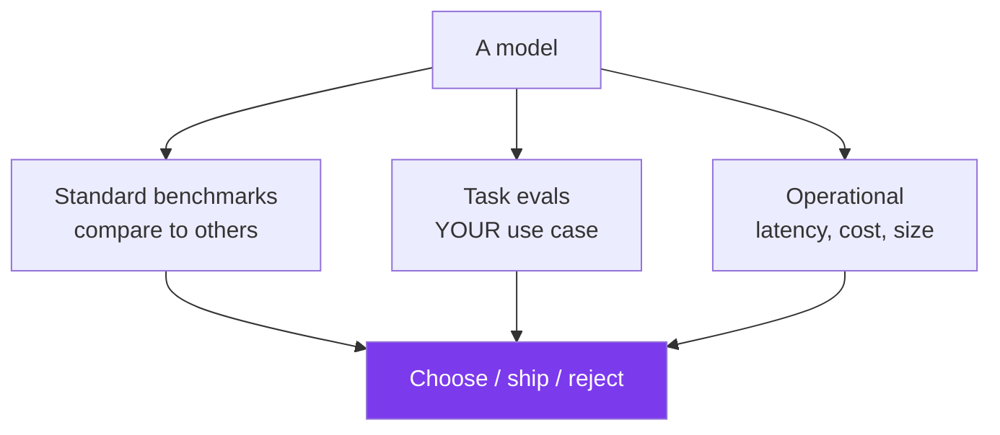
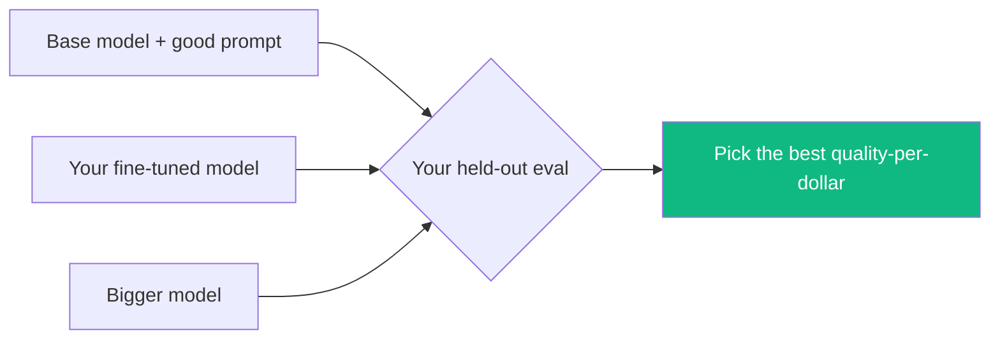
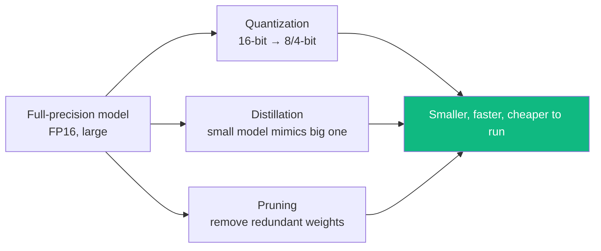
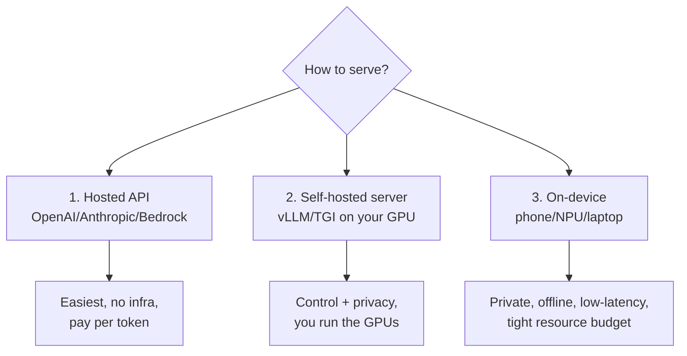
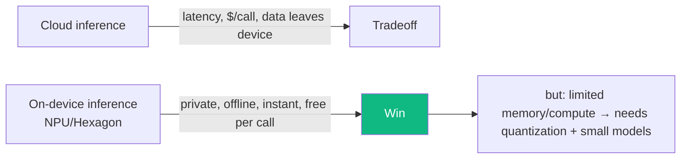
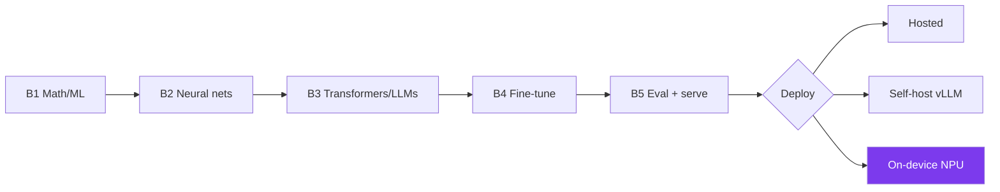

# Module B5 · Model Evaluation, Serving & Deployment

🎯 **Goal:** Close Track B. Measure a model honestly (benchmarks + task evals), then serve it efficiently — quantization, inference servers, and on-device deployment (including the edge). This is how a trained/fine-tuned model becomes something people actually run.

---

## 🧠 Part A — Evaluating models (not just outputs)

In Module 10/11 you evaluated an *app's* outputs. Here you evaluate the *model itself* — to choose between models, or to prove your fine-tune beat the base.



| Eval type | Measures | Examples |
|-----------|----------|----------|
| **Capability benchmarks** | General ability vs other models | MMLU (knowledge), GSM8K (math), HumanEval (code) |
| **Task-specific evals** | Performance on *your* problem | your held-out set + scorers (Module 11) |
| **Human / LLM-judge** | Quality humans care about | preference, helpfulness, groundedness |
| **Operational** | Can you afford to run it? | tokens/sec, latency, memory, $ |

⚠️ **Benchmarks are necessary but gameable.** A high MMLU score doesn't mean it's good at *your* task — and public benchmarks leak into training data ("contamination"). **Your own held-out task eval is the one that matters.** Always compare fine-tune vs base vs a well-prompted baseline on the same private set.



---

## 🧠 Part B — Making models smaller/faster (quantization & friends)

A trained model is often too big/slow to serve cheaply. Three techniques shrink it with minimal quality loss:



| Technique | Idea | Trade-off |
|-----------|------|-----------|
| **Quantization** | Store weights in fewer bits (FP16→INT8/INT4) | Big memory/speed win, tiny quality loss — the default |
| **Distillation** | Train a small "student" to imitate a big "teacher" | Smaller model, near-teacher quality |
| **Pruning** | Drop weights that barely matter | Smaller, needs care |

**Quantization is the workhorse** — it's why a 7B model can run on a phone, and it's central to on-device AI (next).

---

## 🧠 Part C — Serving the model (inference)

Training is one-time; **inference** (running the model to get answers) is forever and is where the ongoing cost lives. You have three deployment shapes:



| Option | Best when | Tools |
|--------|-----------|-------|
| **Hosted API** | Speed to market, no ops, frontier quality | provider APIs |
| **Self-hosted** | Data privacy, custom/fine-tuned models, scale economics | **vLLM**, TGI, Ollama (local), behind FastAPI, in Docker (Module 14) |
| **On-device / edge** | Privacy, offline, ultra-low latency, no per-call cost | quantized models, NPUs |

**Self-hosting essentials:** an inference server like **vLLM** batches requests and manages GPU memory efficiently (high throughput); you wrap it in an API and containerize it. **Ollama** is the easy local route for running open models on your laptop while developing.

```python
# the easiest local serving — run an open model on your machine
# (after installing Ollama)
#   ollama run llama3.2
# then call it like any API:
import requests
r = requests.post("http://localhost:11434/api/generate",
                  json={"model":"llama3.2","prompt":"Explain quantization in 1 line","stream":False})
print(r.json()["response"])
```

---

## 🧠 Part D — On-device AI (the edge)

On-device AI is increasingly important — and a real advantage if you work with hardware. Running models *on the device* — phone, laptop, car, wearable — instead of the cloud.



| | Cloud | On-device |
|---|-------|-----------|
| Privacy | Data leaves device | Stays local ✅ |
| Latency | Network round-trip | Instant ✅ |
| Cost | Per token | Free after download ✅ |
| Capability | Huge models | Limited by device memory |
| Offline | ❌ | ✅ |

**How models get onto a device:** quantize (INT8/INT4) → convert to a mobile runtime (ONNX, TensorFlow Lite, Core ML, or Qualcomm's AI stack targeting the **Hexagon NPU**) → the NPU runs the matrix-multiplies efficiently at low power. NPUs are the "serving" layer for edge AI, measured in TOPS (trillions of operations per second) per watt.

⚠️ **The on-device constraint shapes everything:** memory and power budgets force small, quantized models — which is *why* fine-tuning small models (B4) + quantization (this module) is the relevant skill set for edge AI, more than chasing the biggest frontier model.

---

## 🧠 The full Track B picture



---

## 🛠️ Mini-project — evaluate, quantize, serve

1. Take your B4 fine-tuned model (or any open model). Build a **held-out task eval** with scorers (reuse Module 11) and score: fine-tune vs base vs prompted baseline. Report quality *and* latency/cost.
2. **Quantize** an open model to 4-bit and re-run the eval — measure the quality drop vs the size/speed gain. Decide if the trade is worth it.
3. **Serve it locally** with Ollama (or vLLM if you have a GPU), wrap it behind a small FastAPI endpoint, and call it from your Track A capstone — so your assistant can use a model *you* host.
4. *(Stretch):* research what it would take to run your quantized model on a mobile NPU (e.g. Qualcomm Hexagon, Apple Neural Engine) and write a one-pager.

When your Track A assistant can call a model you fine-tuned, quantized, and served yourself, you've connected both tracks end to end.

---

## ✅ You've mastered this when…

- [ ] You can explain why your own held-out eval beats public benchmarks for decisions
- [ ] You can explain quantization/distillation/pruning and pick quantization by default
- [ ] You can choose hosted vs self-hosted vs on-device for a use case
- [ ] You served an open model locally and called it from your app
- [ ] You can articulate why on-device favors small, quantized, fine-tuned models

---

## 🎓 You've now completed both tracks

**Track A** — you *build with* AI: apps, automation, RAG, agents, multi-agent graphs, observability, harnesses, security. **Track B** — you *build and adapt* AI: the math, neural nets, how LLMs work, fine-tuning, and serving (including on-device, at the edge).

That's the rare full-stack AI engineer: someone who can both ship an agentic product *and* reason about the model underneath it. Now go build something real. 🏛️

**↩ Back to [the roadmap](../README.md) · Lock it in with the [coding sandbox game](../game/index.html).**
